# LangChain

大模型：

- 豆包
- Deepseek
- QWen
- 腾讯元宝
- 华为盘古


大模型应用开发框架：

- LangChain(Python, JavaScript)
- LangChain4j (Java)
- LlamaIndex
- Coze(字节跳动)
- Dify


## 一. Ollama HelloWorld

### 1. 下载Ollama

#### 1. 实现说明

- 在本地安装Ollama，通过Ollama启动Llama3大模型服务

#### 2. 下载Ollama工具

- 选择正确的操作系统，下载Ollama  https://ollama.com/

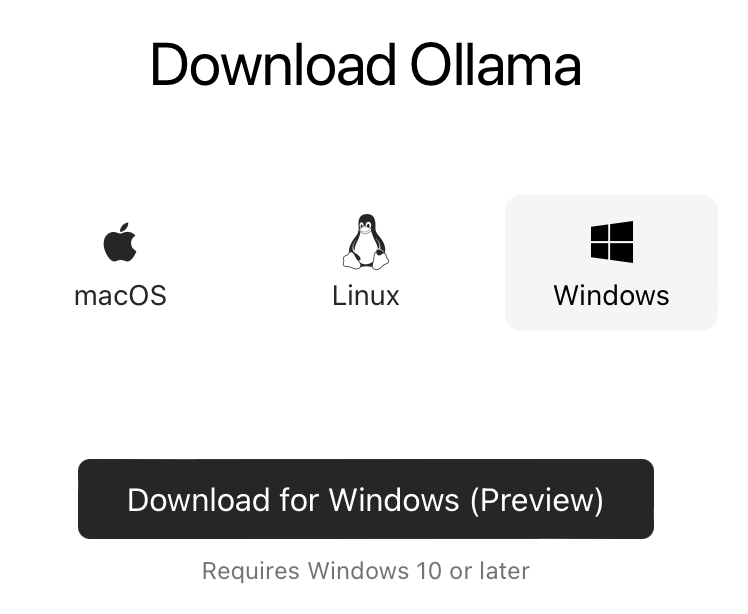

- 下载完成后，双击并安装Ollama软件（默认下一步即可）
- Ollama相关命令

```python
PS C:\Users\qingy> ollama
Usage:
  ollama [flags]
  ollama [command]

Available Commands:
  serve       Start ollama
  create      Create a model from a Modelfile
  show        Show information for a model
  run         Run a model
  stop        Stop a running model
  pull        Pull a model from a registry
  push        Push a model to a registry
  list        List models
  ps          List running models
  cp          Copy a model
  rm          Remove a model
  help        Help about any command

Flags:
  -h, --help      help for ollama
  -v, --version   Show version information

Use "ollama [command] --help" for more information about a command.
```


### 2. 下载并启动Llama3大模型

#### 1. 实现说明

- 在本地下载Llama3模型，根据电脑的配置，选择合适的包；如果内存>=32G, 建议下载Llama 3 70b，共39GB；如果内存<32G, 建议下载Llama 3 8b，共4.7GB

#### 2. 下载Llama3 8b模型并启动

- 打开终端命令行，下载Llama3 8b 模型，该模型文件大约4.7GB（如下图所示）

> ollama pull  llama3

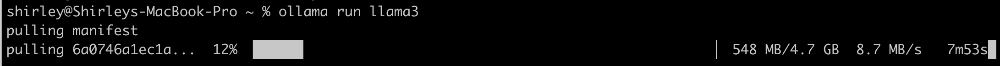

- 完成下载后，终端如下所示：

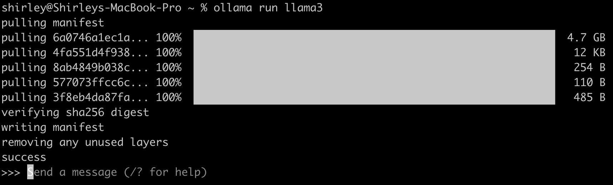

- 浏览器输入URL地址 **localhost:11434**    

- 确保Ollama服务启动成功

  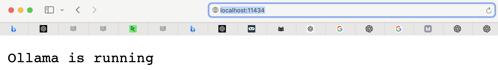


### 3. 请求Llama3

#### 1. Ollama 服务接口地址

```python
url = "http://localhost:11434/api/chat"
```

#### 2. 使用CURL命令请求

curl请求

```powershell
Invoke-RestMethod -Uri http://localhost:11434/api/chat -Method Post -ContentType "application/json" -Body '{
  "model": "qwen:0.5b", 
  "messages": [
    {
      "role": "user",
      "content": "who wrote the book godfather?"
    }
  ],
  "stream": false
}'
```

请求结果

```powershell
model                : llama3
created_at           : 2025-06-30T06:07:50.2575002Z
message              : @{role=assistant; content=The novel "The Godfather" was written by Mario Puzo. The book was publ
                       ished in 1969 and became a huge success, helping to establish Puzo as a prominent author of crim
                       e fiction.

                       Puzo's story is loosely based on the real-life experiences of Italian-American mobsters, particu
                       larly the Five Families of New York City. The novel follows the Corleone family, led by Don Vito
                        Corleone (played by Marlon Brando in the iconic 1972 film adaptation), as they navigate the com
                       plex and violent world of organized crime.

                       Puzo went on to write several sequels and spin-offs, including "The Last Don" and "The Fourth K,
                       " but his most famous work remains "The Godfather." The book has been translated into numerous l
                       anguages and has sold millions of copies worldwide.}
done_reason          : stop
done                 : True
total_duration       : 49188003200
load_duration        : 6481071300
prompt_eval_count    : 17
prompt_eval_duration : 1516681200
eval_count           : 170
eval_duration        : 41181755000
```


#### 3. 使用requests请求

```python
import requests
```

创建请求函数

```python
def llama3(prompt):
    
    # 请求体
    data = {
        "model": "llama3",
        "messages": [
            {
                "role": "user",
                "content": prompt
            }
        ],
        "stream": False
    }
	
    # 请求头
    headers = {
        'Content-Type': 'application/json'
    }
    
   
    response = requests.post(url, headers=headers, json=data)
    return (response.json())
    # return (response.json()['message']['content'])

```

调用请求函数

```python
prompt = " hi , who are you ? "

response = llama3(prompt)
print(response)
```


### 4. 实训内容

基于prompt和Ollama聊天程序。

#### 1. 读取问题文本

##### 1 data.txt问题文件

- 手动创建data.txt，添加要提问的电视剧台词内容

  ```python
  In West Philadelphia born and raised
  On the playground was where I spent most of my days
  Chillin' out, maxin', relaxin', all cool
  And all shootin' some b-ball outside of the school
  ```

##### 2 读取问题内容函数

- 手动创建llama3_document.py文件，实现函数read_data_from_file

  ```python
  def read_data_from_file(file_path):
      with open(file_path, 'r') as file:
          return file.read()
  ```

#### 2. 创建模型和prompt

##### 1 导入必要的包

```python
import requests
```

##### 2 发送post请求

- 将test_llama3.py文件的函数定义直接拷贝到llama3_document.py文件中即可

```python
url = "http://localhost:11434/api/chat"

def llama3(prompt):
    data = {
        "model": "llama3",
        "messages": [
            {
                "role": "user",
                "content": prompt
            }
        ],
        "stream": False
    }

    headers = {
        'Content-Type': 'application/json'
    }
    response = requests.post(url, headers=headers, json=data)

    return (response.json()['message']['content'])
```

#### 3 读取问题文件内容

```python
file_path = 'data.txt'
external_data = read_data_from_file(file_path)
```

#### 4 创建prompt并获取返回结果

```python
prompt = f"Based on the following data: {external_data}, what TV show is this about?"

response = llama3(prompt)
print(response)
```

- 运行llama3_document.py，查看控制台显示结果

  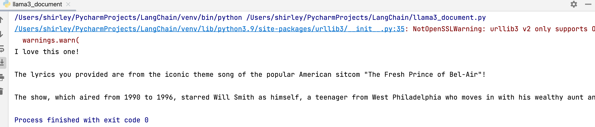


> 根据个人喜好下载使用其他模型，更换问题，测试模型回复。


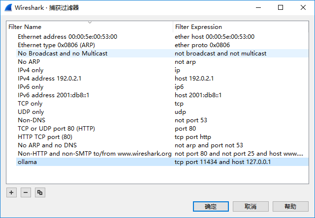


> WireShark 捕获过滤器
>
> tcp port 11434 and host 127.0.0.1
>
> 显示过滤器
>
> ip.addr == 127.0.0.1 && tcp.port == 11434 && http.request.uri contains "/api"


## 二. LangChain HelloWorld

### 1. LangChain安装

```
pip install langchain -i https://pypi.tuna.tsinghua.edu.cn/simple
pip install langchain_openai -i https://pypi.tuna.tsinghua.edu.cn/simple
pip install langchain_ollama -i https://pypi.tuna.tsinghua.edu.cn/simple
```

 

### 2. LangChain Llama3

使用LangChain框架请求Llama3

```python
from langchain_ollama import ChatOllama
llm = ChatOllama(model="llama3", temperature=0)

response = llm.invoke("Hi!")
print(response.content)
```


### 3. LangChain DeepSeek

#### 1. 注册 DeepSeek

开发平台地址：https://platform.deepseek.com/sign_in

将`OPENAI_API_KEY`设置为环境变量

```dotenv
sk-569d456dc26d41e39831c9cfd3428703
```

#### 2. LangChain DeepSeek

##### llm_deepseek.py

```python
from langchain_openai.chat_models.base import BaseChatOpenAI

llm = BaseChatOpenAI(
    model='deepseek-chat',
    # openai_api_key='sk-111111111111112222222222222',
    openai_api_base='https://api.deepseek.com',
    max_tokens=1024
)

response = llm.invoke("Hi!")
print(response.content)
```


### 4.  Token

南京市 / 长江大桥

南京市长 / 江大桥


> 需要科学上网

##### 3.1 token-BPE-deepseek-huggingFace

```python
from transformers import AutoTokenizer

# HuggingFace 上的 deepseek-r1 tokenizer
tokenizer = AutoTokenizer.from_pretrained("deepseek-ai/deepseek-r1")

text = "9.11 and 9.8, which is greater?"
tokens = tokenizer.tokenize(text)
print(tokens)
print("Total tokens:", len(tokens))
```

输出  

```python
['9', '.', '11', 'Ġand', 'Ġ', '9', '.', '8', ',', 'Ġwhich', 'Ġis', 'Ġgreater', '?']
Total tokens: 13
```

---


##### 3.2 token-BPF-LLaMA

```python
# conda install -c conda-forge sentencepiece

from transformers import LlamaTokenizer

tokenizer = LlamaTokenizer.from_pretrained("huggyllama/llama-7b")
text = "9.11 and 9.8, which is greater?"
tokens = tokenizer.tokenize(text)
print(tokens)
print("Total tokens:", len(tokens))
```

输出

```shell
['▁', '9', '.', '1', '1', '▁and', '▁', '9', '.', '8', ',', '▁which', '▁is', '▁greater', '?']
Total tokens: 15
```


> 注册DeepSeek，获取API Key
>
> pip install transformers  -i https://pypi.tuna.tsinghua.edu.cn/simple


## 三. LangChain Message

### 1. 导入相关类

```python
from langchain_core.messages import (
    HumanMessage,
    AIMessage,
    SystemMessage,
    ToolMessage
)
```

### 2. 人类消息 (HumanMessage)

```python
messages = [
    HumanMessage(content="量子计算的主要优势是什么？")
]
response = model.invoke(messages)
print("==== 基础对话 ====")
print(f"AI: {response.content}\n")
```

### 3. 系统消息 (SystemMessage)

```python
messages = [
    SystemMessage(content="你是一位科技史专家，用简短的列表回答问题"),
    HumanMessage(content="列出计算机发展史上的三个重要里程碑")
]
response = model.invoke(messages)
print("==== 带系统提示的对话 ====")
print(f"AI: {response.content}\n")
```

### 4. AI消息（AIMessage）

```python
from langchain_core.messages import HumanMessage, AIMessage, SystemMessage

# 1. 定义系统指令 (设定AI角色)
system_message = SystemMessage(
    content="你是一个天气助手，用简洁的句子回复用户关于天气的提问。"
)

# 2. 模拟用户输入
user_message = HumanMessage(
    content="今天北京的天气怎么样？"
)

# 3. 模拟AI生成回复 (实际应用中这里会调用语言模型)
# 此处直接构造 AIMessage 作为AI的响应
ai_response = AIMessage(
    content="北京今天晴天，气温 25°C，空气质量优。建议穿轻薄衣物。"
)

# 打印对话流程
print("=== 对话开始 ===")
print(f"[系统指令]: {system_message.content}")
print(f"[用户]: {user_message.content}")
print(f"[AI助手]: {ai_response.content}")
print("=== 对话结束 ===")
```

关键点说明：

1. **`AIMessage` 的作用** 
   表示 AI 生成的回复内容，通常**由语言模型生成**。在这个例子中，我们直接构造了 `AIMessage` 对象来模拟 AI 的输出。

2. **完整对话流程**  
   - `SystemMessage`：设定 AI 的行为规范（系统级指令）
   - `HumanMessage`：用户输入的问题/指令
   - `AIMessage`：AI 生成的回复内容

3. **实际应用场景**  
   在真实代码中，`AIMessage` 通常由语言模型生成（例如结合 `DeepSeek`）：


### 5. 工具消息 (ToolMessage)

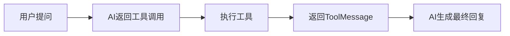
```mermaid
graph LR
A[用户提问] --> B[AI返回工具调用]
B --> C[执行工具]
C --> D[返回ToolMessage]
D --> E[AI生成最终回复]
```

#### 1. ToolMessage

```python
messages = [
    HumanMessage(content="旧金山现在的温度是多少？"),
    AIMessage(
        content="",
        tool_calls=[{
            "name": "get_current_weather",
            "args": {"location": "San Francisco"},
            "id": "tool_123"
        }]
    ),
    ToolMessage(
        tool_call_id="tool_123",
        name="get_current_weather",
        content='{"temperature": "22°C", "condition": "Sunny"}'
    )
]

response = model.invoke(messages)
print("==== 工具调用场景 ====")
print(f"AI: {response.content}\n")
```


#### 2. ToolMessage From Function

查询电脑系统信息（CPU、内存、磁盘等），使用 `psutil` 库获取实时系统数据：

1. **自定义系统信息工具**：
   - 使用 `psutil` 库获取实时系统数据
   - 支持多种查询类型：CPU、内存、磁盘、网络
   - 添加错误处理确保稳定性

2. **工具调用流程**：

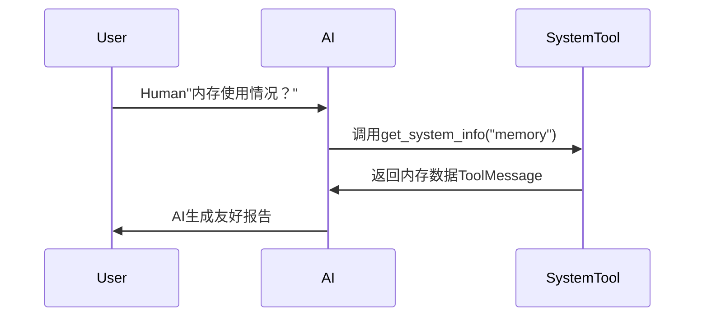
```mermaid
sequenceDiagram
   participant User
   participant AI
   participant SystemTool

   User->>AI: Human"内存使用情况？"
   AI->>SystemTool: 调用get_system_info("memory")
   SystemTool->>AI: 返回内存数据ToolMessage
   AI->>User: AI生成友好报告
```


##### tools.py

```python
# 修复工具定义 - 使用正确的调用方式
def get_system_info(info_type: str, call_id: str) -> str:
    print( f"正在处理工具调用: {call_id}")
    """获取电脑系统信息"""
    try:
        if info_type == "cpu":
            return f"CPU使用率: {psutil.cpu_percent()}%\n" \
                   f"核心数: {psutil.cpu_count(logical=False)}物理/{psutil.cpu_count()}逻辑"

        elif info_type == "memory":
            mem = psutil.virtual_memory()
            return f"内存使用: {mem.used / 1024 ** 3:.1f}GB/{mem.total / 1024 ** 3:.1f}GB ({mem.percent}%)\n" \
                   f"可用内存: {mem.available / 1024 ** 3:.1f}GB"

        elif info_type == "all":
            return "\n".join([
                get_system_info("cpu"),
                get_system_info("memory")
            ])

        else:
            return f"未知查询类型: {info_type}"

    except Exception as e:
        return f"查询失败: {str(e)}"
```

##### main.py

```python
# 生成唯一调用ID
call_id = f"tool_{uuid.uuid4().hex[:8]}"
print(f"工具调用请求ID: {call_id}")

# 构建消息序列
messages = [
    HumanMessage(content="查看CPU使用率"),
    SystemMessage(content="你是一个系统监控助手。在回复工具调用结果时，必须在回答中包含工具调用ID（call_id）。"),
    # AI请求工具调用
    AIMessage(
        content="",
        tool_calls=[{
            "name": "get_system_info",
            "args": {"info_type": "cpu", "call_id": call_id},
            "id": call_id
        }]
    ),

    # 工具返回结果
    ToolMessage(
        tool_call_id=call_id,  # 关键关联标识
        content=get_system_info("cpu",call_id)  # 直接调用工具函数
    )
]

# 获取模型响应
response = llm.invoke(messages)

print("==== 系统信息查询结果 ====")
print(f"AI回复内容: {response.content}")
```


## 四. Function Call


### 1. Function Call 简介

以前的 AI 大模型就像一个知识丰富但被困在屋子里的人，只能依靠自己已有的知识回答问题，无法直接获取实时数据或与外部系统交互，比如不能直接访问数据库里的最新信息，也不能使用一些外部工具来完成特定任务。

`Function Call`是`OPEN AI`在`2023`年推出的一个非常重要的概念：

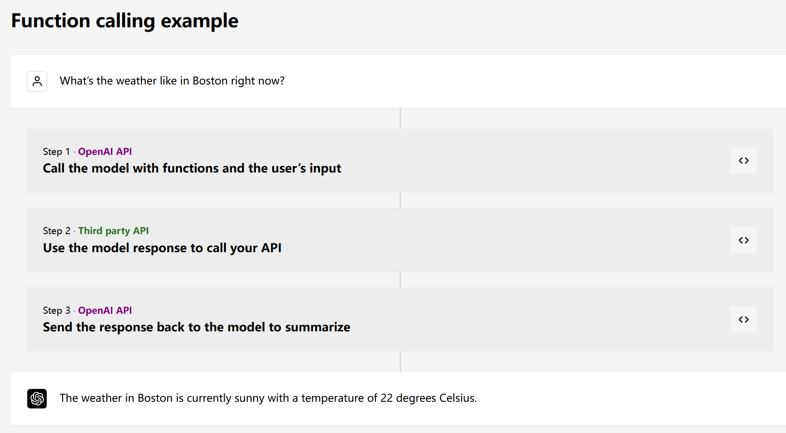

`Function Call`（函数调用） 本质上就是**提供了大模型与外部系统交互的能力，类似于给大模型安装一个 “外挂工具箱”**。当大模型遇到自己无法直接回答的问题时，它会主动调用预设的函数（如查询天气、计算数据、访问数据库等），获取实时或精准信息后再生成回答。

这个能力确实是挺好的，给了大模型更多的可能性，但是它有一个比较大的缺点，就是实现成本太高了。

在`MCP`出现之前，开发者想实现`Function Call`的成本是比较高的，首先得需要模型本身能够稳定支持`Function Call`的调用，比如在 Coze 中选择某些模型时提示，选择的模型不支持插件的调用，其实就是不支持`Function Call`的调用。

在模型训练微调时，标准的sharegpt风格的数据集中提供了专门用于Function Call训练的特殊字段：

```json 
[
  {
    "conversations": [
      {
        "from": "human",
        "value": "人类指令"
      },
      {
        "from": "function_call",
        "value": "工具参数"
      },
      {
        "from": "observation",
        "value": "工具结果"
      },
      {
        "from": "gpt",
        "value": "模型回答"
      }
    ],
    "system": "系统提示词（选填）",
    "tools": "工具描述（选填）"
  }
]
```


这也就意味着模型本身需要进行过专门的`Function Call`调用微调才能稳定支持这种能力。

另外还有一个比较大的问题，`OPEN AI`最开始提出这项技术的时候，并没有想让它成为一项标准，所以虽然后续很多模型也支持了`Function Call`的调用，但是各自实现的方式都不太一样。

这也就意味着，如果要发开一个`Function Call`工具，需要对不同的模型进行适配，比如参数格式、触发逻辑、返回结构等等，这个成本是非常高的。

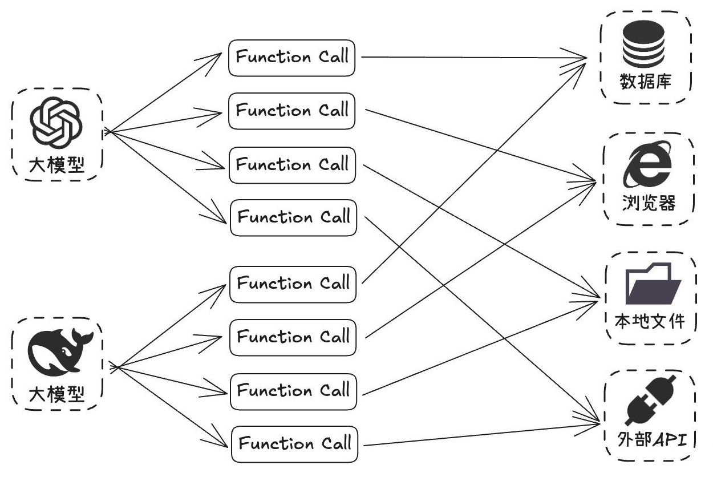


### 2. Function Calling

#### 1. 工具

使用第三部分工具消息中的`tools.py`。

#### 2. 大模型

llm_deepseek.py 

> 需要注意的是，此处使用了DeepSeek，而没有使用llama3，因为Llama3不支持Tools

#### 3. 系统提示词

system_prompt.py

```python
TOOL_DESCRIPTION = """
你可以使用以下工具查询系统信息：
[
    {
      "name": "get_system_info",
      "description": "获取电脑系统信息",
      "parameters": {
        "properties": {
          "info_type": {
            "enum": ["cpu", "memory", "all"]
          }
        },
        "required": ["info_type"]
      }
    }
]
"""

SystemMessage(content=f"你是一个系统监控助手。{TOOL_DESCRIPTION}\n"
                      "你必须严格遵守以下规则：\n"
                      "情况1：当user需要查询系统信息时，你只能输出<tool_call>包裹的JSON调用请求来调用Tools，"
                      "绝对禁止在<tool_call>之外添加任何其他文本、解释或模拟结果。"
                      "调用格式必须严格包含name和parameters字段\n"
                      "情况2. 当收到ToolMessage后，根据实际结果生成最终回复\n"),
```


#### 4. 响应解析器

common.py

```python
def parse_tool_calls(model_response: str):
    """
    从模型响应中解析工具调用请求
    期望格式:
    <tool_call>
    {
        "name": "get_system_info",
        "parameters": {
            "info_type": "cpu"
        }
    }
    </tool_call>
    """
    start_tag = "<tool_call>"
    end_tag = "</tool_call>"

    if start_tag in model_response and end_tag in model_response:
        # 提取JSON部分
        json_str = model_response.split(start_tag)[1].split(end_tag)[0].strip()
        try:
            tool_call = json.loads(json_str)
            return [tool_call]
        except json.JSONDecodeError:
            print(f"无法解析工具调用JSON: {json_str}")
            return []
    return []
```

#### 5. 工具执行器

common.py

```python
# 自定义工具执行器
def execute_tool_call(tool_call):
    """执行工具调用并返回结果"""
    if tool_call["name"] == "get_system_info":
        args = tool_call.get("parameters", {})
        info_type = args.get("info_type", "cpu")
        return get_system_info(info_type)
    return f"未知工具: {tool_call['name']}"
```


#### 6. Main

```python
import json
import uuid

from langchain_core.messages import HumanMessage, ToolMessage, AIMessage
from llm_deepseek import llm
from system_prompt import system_message
from common import parse_tool_calls, execute_tool_call

# 用户请求
human_message = HumanMessage(content="请帮我查看当前CPU使用情况")
messages = [system_message[0], human_message]
print(messages)
response = llm.invoke(messages)
response_content = response.content
print(response_content)

# 检查是否有工具调用
tool_calls = parse_tool_calls(response.content)
if not tool_calls:
    print("\n==== 最终回复：无工具调用请求，exit ====")
    print(response_content)
    exit()

tool_messages = []
for tool_call in tool_calls:
    print(f"\n检测到工具调用: {tool_call['name']}({tool_call['parameters']})")

    # 创建唯一调用ID
    call_id = f"call_{uuid.uuid4().hex[:6]}"

    # 执行工具
    tool_result = execute_tool_call(tool_call, call_id)

    # 构建工具消息（自定义格式）
    tool_msg = ToolMessage(tool_call_id=call_id, content=tool_result)

    tool_messages.append(tool_msg)

    # 将工具响应加入消息历史（AI与Tool的关联依赖于tool_call_id）
    messages.append(
        AIMessage(content=response_content,
                  additional_kwargs={
                      "tool_calls": [{
                          "id": call_id,  # 生成唯一ID
                          "type": "function",  # 必须字段
                          "function": {
                              "name": tool_call["name"],  # 工具名称
                              "arguments": json.dumps(tool_call["parameters"])  # 参数需转为JSON字符串
                          }
                      }]
                  }
                  ))  # 保存原始模型响应

messages.extend(tool_messages)  # 添加工具响应

# 将工具结果发送给模型生成最终回复
final_response = llm.invoke(messages)
print(final_response.content)
```


### 3. 项目实训

> 1. 计算器工具
> 2. 帮我打开某个应用程序
> 3. 执行某命令
> 4. 调用某外部API
>
>    ... ...


---


## 五. LangChain Prompt

### 1. Prompt Template

#### 1. `PromptTemplate()` 构造函数  

**功能**：显式创建文本提示模板  
**签名**：  
```python
from langchain.prompts import PromptTemplate
PromptTemplate(
    input_variables: List[str],   # 声明模板中的变量名
    template: str                # 含{}占位符的模板文本
)
```

**示例**：  
```python
from langchain.prompts import PromptTemplate

template = """
你是一个资深产品经理，请为{product}撰写一段推广文案。
要求：
- 突出产品核心优势
- 使用{tone}的语言风格
- 不超过50字
"""

# 显式定义输入变量
prompt = PromptTemplate(
    input_variables=["product", "tone"],
    template=template
)

print(prompt.input_variables)
```

---

#### 2. `PromptTemplate.from_template()`  
**功能**：自动提取变量创建模板（推荐用法）  
**特点**：  

- 自动识别模板中的 `{变量}`  
- 无需手动声明 `input_variables`  
- 内置防错机制  

**示例**：  
```python
from langchain.prompts import PromptTemplate
# 单行创建（自动提取{framework}和{function}）
auto_prompt = PromptTemplate.from_template(
   """
    你是一个资深产品经理，请为{product}撰写一段推广文案。
    要求：
    - 突出产品核心优势
    - 使用{tone}的语言风格
    - 不超过50字
    """)

# 验证变量
print(auto_prompt.input_variables)
```

---

#### 3. `ChatPromptTemplate.from_messages()`  
**功能**：创建多角色对话模板（用于聊天模型）  
**消息格式**：  
```python
("role_type", "content_template")  
# 角色类型：human/AI/system/function
```

**示例**：  
```python
from langchain.prompts import ChatPromptTemplate

chat_template = ChatPromptTemplate.from_messages([
    ("system", "你是{domain}专家，用{level}级别术语回答"),
    ("human", "解释什么是{concept}"),
    ("ai", "好的，我会从{aspect}角度解释")
])

# 生成对话提示
messages = chat_template.format_messages(
    domain="量子物理",
    level="本科生",
    concept="量子纠缠",
    aspect="数学原理"
)

print(messages)

# 输出结构化消息
for msg in messages:
    print(f"{msg.type}: {msg.content}")
```

`messages` 是个列表：

```python
[SystemMessage(content='你是量子物理专家，用本科生级别术语回答', additional_kwargs={}, response_metadata={}), 
 HumanMessage(content='解释什么是量子纠缠', additional_kwargs={}, response_metadata={}), AIMessage(content='好的，我会从数学原理角度解释', additional_kwargs={}, response_metadata={})]
```

---

#### 4. `prompt_template.format()`  
**功能**：直接生成**字符串格式**的完整提示  
**返回值**：`str`  
**特点**：  
- 适用于文本补全模型  
- 输出为纯文本  

**示例**：  
```python
from langchain.prompts import PromptTemplate
text_prompt = PromptTemplate.from_template(
    "将'{text}'翻译成{language}，保留专业术语"
)

result = text_prompt.format(
    text="Artificial Intelligence", 
    language="法语"
)

print(type(result))  # <class 'str'>
print(result)        # 将'Artificial Intelligence'翻译成法语，保留专业术语
```

---

#### 5. `prompt_template.format_prompt()`  
**功能**：生成 **`PromptValue` 对象**（保留结构化信息）  
**返回值**：  
- `.to_string()` → 文本字符串  
- `.to_messages()` → 消息列表（用于聊天模型）  

**示例**：  
```python
# 复用之前的聊天模板
prompt_value = chat_template.format_prompt(
    domain="量子物理",
    level="本科生",
    concept="量子纠缠",
    aspect="数学原理"
)
print(prompt_value)

# 转换输出
print("--- 文本模式 ---")
print(prompt_value.to_string())  # 单字符串

print("\n--- 消息模式 ---")
for msg in prompt_value.to_messages():
    print(f"[{msg.type.upper()}] {msg.content}")  # 结构化消息
```

```python
messages=[
    SystemMessage(content='你是量子物理专家，用本科生级别术语回答', additional_kwargs={}, response_metadata={}), 
    HumanMessage(content='解释什么是量子纠缠', additional_kwargs={}, response_metadata={}), 
    AIMessage(content='好的，我会从数学原理角度解释', additional_kwargs={}, response_metadata={})]
```


#### 核心对比表  

| 方法                         | 输出类型       | 最佳适用场景          | 关键优势                     |
|------------------------------|---------------|----------------------|----------------------------|
| `PromptTemplate()`           | 模板对象      | 需要精确控制变量的模板 | 显式声明变量，避免歧义       |
| `from_template()`            | 模板对象      | 快速开发场景          | 自动提取变量，代码简洁       |
| `from_messages()`            | 聊天模板对象  | 多轮对话系统          | 支持角色分离，结构化对话     |
| `format()`                   | 字符串        | 文本补全模型          | 直接获得可输入模型的文本     |
| `format_prompt().to_string()`| 字符串        | 需兼容文本模型        | 保留元数据，可回溯           |
| `format_prompt().to_messages()` | 消息列表     | 聊天模型API调用       | 符合OpenAI等聊天接口规范     |


### 2. MessagePlaceHolder

#### 简单插入历史消息示例
```python
from langchain_core.prompts import ChatPromptTemplate, MessagesPlaceholder
from langchain_core.messages import SystemMessage, HumanMessage, AIMessage

# 创建一个包含系统消息、历史消息占位符和人类问题的提示模板
prompt = ChatPromptTemplate.from_messages([
    SystemMessage(content="You are a helpful assistant."),
    MessagesPlaceholder(variable_name="history"),
    HumanMessage(content="{question}")
])

# 模拟一些历史消息
history = [
    HumanMessage(content="What's the weather today?"),
    AIMessage(content="It's sunny and warm."),
]

# 调用提示模板，传入历史消息和当前问题
formatted_prompt = prompt.format_prompt(history=history, question="Can you recommend a good book to read?")
print(formatted_prompt.to_messages())
```
在这个示例中，定义了一个聊天提示模板，其中包含系统消息、用于插入历史消息的`MessagesPlaceholder` 以及人类的问题。接着模拟了一些历史消息，最后通过`format_prompt` 方法将历史消息和当前问题传入提示模板，获取格式化后的消息列表。

#### 限制插入历史消息数量示例
```python
from langchain_core.prompts import ChatPromptTemplate, MessagesPlaceholder
from langchain_core.messages import SystemMessage, HumanMessage, AIMessage

# 创建一个包含系统消息、限制为最近一条的历史消息占位符和人类问题的提示模板
prompt = ChatPromptTemplate.from_messages([
    SystemMessage(content="You are a helpful assistant."),
    MessagesPlaceholder(variable_name="history", n_messages=1),
    HumanMessage(content="{question}")
])

# 模拟多条历史消息
history = [
    HumanMessage(content="What's the weather today?"),
    AIMessage(content="It's sunny and warm."),
    HumanMessage(content="Great, thank you!"),
    AIMessage(content="You're welcome!")
]

# 调用提示模板，传入历史消息和当前问题
formatted_prompt = prompt.format_prompt(history=history, question="Can you tell me something else interesting?")
print(formatted_prompt.to_messages())
```
该示例通过`n_messages` 参数设置只插入最近的一条历史消息 ，即便模拟的`history` 列表中有多条消息，最终也只会取最新的一条插入到提示模板中参与后续处理 。 


### 3. FewShotPromptTemplate

`FewShotPromptTemplate` 是 LangChain 中用于实现 Few-Shot Learning（少量样本学习）的核心组件，通过提供少量示例引导语言模型生成符合特定模式的输出。以下是其函数签名及参数的详细介绍：


#### **函数签名**
```python
class FewShotPromptTemplate(BasePromptTemplate):
    def __init__(
        self,
        examples: Optional[List[Dict[str, Any]]] = None,
        example_selector: Optional[BaseExampleSelector] = None,
        example_prompt: PromptTemplate,
        prefix: str = "",
        suffix: str = "",
        input_variables: List[str],
        example_separator: str = "\n\n",
        validate_template: bool = True,
        **kwargs: Any,
    ) -> None:
        ...
```


#### **核心参数解析**
##### 1. **示例提供方式（互斥参数）**
- **`examples`**  
  - **类型**：`List[Dict[str, Any]]`  
  - **说明**：直接提供少量示例数据，每个示例是一个字典，包含输入和输出字段。  
  - **示例**：  
    ```python
    examples = [
        {"question": "北京有多少人口？", "answer": "约2154万"},
        {"question": "上海有多少人口？", "answer": "约2487万"},
    ]
    ```

- **`example_selector`**  
  - **类型**：`BaseExampleSelector`  
  - **说明**：使用示例选择器动态管理示例（如按长度、相似度筛选）。  
  - **冲突规则**：不能与 `examples` 同时使用。  
  - **示例**：  
    ```python
    from langchain_core.example_selectors import LengthBasedExampleSelector
    example_selector = LengthBasedExampleSelector(
        examples=examples,
        example_prompt=example_prompt,
        max_length=200
    )
    ```


##### 2. **示例模板**
- **`example_prompt`**  
  - **类型**：`PromptTemplate`  
  - **说明**：定义每个示例的格式，指定输入变量。  
  - **示例**：  
    ```python
    example_prompt = PromptTemplate(
        input_variables=["question", "answer"],
        template="问：{question}\n答：{answer}"
    )
    ```


##### 3. **提示结构**
- **`prefix`**  
  - **类型**：`str`  
  - **说明**：位于所有示例之前的文本，通常用于介绍任务。  
  - **示例**：  
    ```python
    prefix = "请参考以下示例回答问题："
    ```

- **`suffix`**  
  - **类型**：`str`  
  - **说明**：位于所有示例之后的文本，通常包含用户输入占位符。  
  - **示例**：  
    ```python
    suffix = "问：{input}\n答："
    ```

- **`example_separator`**  
  - **类型**：`str`  
  - **说明**：示例之间的分隔符（默认 `"\n\n"`）。  


##### 4. **输入变量**
- **`input_variables`**  
  - **类型**：`List[str]`  
  - **说明**：提示模板中期望的输入变量名称（如 `["input"]`）。  


##### 5. **其他参数**
- **`validate_template`**  
  - **类型**：`bool`  
  - **说明**：是否在初始化时验证模板有效性（默认 `True`）。  


#### **工作流程**
1. **组装示例**：通过 `examples` 或 `example_selector` 获取示例。
2. **格式化示例**：使用 `example_prompt` 格式化每个示例。
3. **拼接提示**：按 `prefix → 示例 → suffix` 的顺序拼接完整提示。
4. **注入用户输入**：将 `input_variables` 替换为实际值。


#### **典型应用场景**
1. **文本风格转换**（如专业术语转通俗表达）
2. **特定领域问答**（如法律、医疗）
3. **分类任务**（如情感分析、意图识别）
4. **代码生成**（提供函数示例，生成类似函数）

#### 示例1：基础Few-Shot学习示例
```python
from langchain_ollama import ChatOllama
from langchain.prompts import FewShotPromptTemplate, PromptTemplate
from langchain_core.example_selectors import LengthBasedExampleSelector

# 初始化模型
llm = ChatOllama(model="llama3", temperature=0)

# 定义Few-Shot示例（语言翻译）
examples = [
    {"input": "Hello", "output": "你好"},
    {"input": "Goodbye", "output": "再见"},
    {"input": "Thank you", "output": "谢谢"},
]

# 创建示例模板
example_prompt = PromptTemplate(
    input_variables=["input", "output"],
    template="输入: {input}\n输出: {output}"
)

# 创建Few-Shot提示模板
prompt_template = FewShotPromptTemplate(
    examples=examples,
    example_prompt=example_prompt,
    prefix="将英语翻译成中文:",
    suffix="输入: {input}\n输出:",
    input_variables=["input"],
    example_selector=LengthBasedExampleSelector(
        examples=examples,
        example_prompt=example_prompt,
        max_length=200  # 根据模型上下文长度调整
    )
)

# 执行翻译
input_text = "Welcome"
formatted_prompt = prompt_template.format(input=input_text)
response = llm.invoke(formatted_prompt)

print(f"输入: {input_text}")
print(f"输出: {response.content.strip()}")
```


#### 示例2：典型场景 - 情感分析分类器
```python
from langchain_ollama import ChatOllama
from langchain import PromptTemplate, FewShotPromptTemplate
from langchain.chains import LLMChain

# 初始化模型
llm = ChatOllama(model="llama3", temperature=0)

# 定义情感分析示例
examples = [
    {"text": "这部电影太棒了！特效超震撼", "sentiment": "积极"},
    {"text": "这个餐厅的服务真差，等了一个小时", "sentiment": "消极"},
    {"text": "今天天气还可以，适合散步", "sentiment": "中性"},
]

# 创建示例模板
example_template = """
文本: {text}
情感: {sentiment}
"""

# 创建Few-Shot提示模板
prompt = FewShotPromptTemplate(
    examples=examples,
    example_prompt=PromptTemplate(
        input_variables=["text", "sentiment"],
        template=example_template
    ),
    prefix="请分析以下文本的情感倾向（积极/消极/中性）:",
    suffix="文本: {input}\n情感:",
    input_variables=["input"]
)

# 创建LLM链
chain = LLMChain(llm=llm, prompt=prompt)

# 测试情感分析
test_text = "这个手机的电池续航太差了，用了半天就没电了"
result = chain.run(input=test_text)

print(f"文本: {test_text}")
print(f"情感: {result.strip()}")
```


### 4. 基于LangChain和Ollama的Ice Cream chatbot

#### 1. 构建prompt

##### 1. 创建prompt模板

- 创建prompt.py文件

- 导入必要的包

  > from langchain.prompts import PromptTemplate

##### 2. 设置指令

- 添加简单指令，告诉冰激凌chatbot做什么

```python
ice_cream_assistant_prompt = """
You are an ice cream assistant chatbot named "Scoopsie". Your expertise is 
exclusively in providing information and advice about anything related to ice creams. This includes flavor combinations, ice cream recipes, and general 
ice cream-related queries. You do not provide information outside of this 
scope. If a question is not about ice cream, respond with, "I specialize only in ice cream related queries." 
Question: {question} 
Answer:"""
```

##### 3. prompt模板

- 创建PromptTemplate模板对象，输入参数为用户提问的问题

```python
ice_cream_prompt_template = PromptTemplate(
    input_variables=["question"],
    template=ice_cream_assistant_prompt
)
```

#### 2. 构建简单的chatbot

##### 1. 创建ollama对象

- 手动创建simple_chatbot.py文件，创建ChatOllama对象

  ```python
  from langchain_community.chat_models import ChatOllama
  
  llm = ChatOllama(model="llama3", temperature=0)
  ```

##### 2. 创建LLMChain对象

- 创建LLMChain对象

  ```python
  from langchain.chains import LLMChain
  from prompts import ice_cream_prompt_template
  llm_chain = LLMChain(llm=llm, prompt=ice_cream_prompt_template)
  ```

##### 3. 查看返回结果

- 给定一个问题question，调用**invoke**方法（不需要post请求），打印结果

  ```python
  question = "Who are you?"
  print(llm_chain.invoke({'question': question})['text'])
  ```

- 查看控制台返回结果

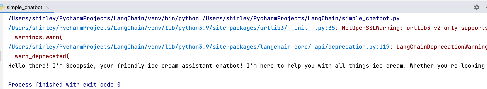


## 六. LangChain Parser

### 1. Pydantic

Pydantic 是一个用于 **数据验证和设置管理** 的 Python 库，主要基于 Python 类型注解（Type Hints）。它广泛应用于 API 开发、配置管理、数据序列化/反序列化等场景，尤其在 FastAPI 等现代 Web 框架中被深度集成。

---

#### **核心特性**

1. **类型注解驱动**  
   使用 Python 原生类型注解定义数据结构，自动验证输入数据是否符合类型约束（如 `str`, `int`, `List` 等）。

2. **数据验证**  
   自动验证输入数据，并在无效时抛出清晰的错误信息。支持自定义验证规则。

3. **序列化与反序列化**  
   轻松将模型转换为 JSON、字典等格式（如 `.model_dump()`、`.model_dump_json()`），或从这些格式加载数据。

4. **默认值与可选字段**  
   通过 `Optional` 和 `Field` 定义可选字段或带默认值的字段（如 `version: Optional[str] = None`）。

5. **嵌套模型**  
   支持复杂嵌套数据结构（如模型内包含其他模型）。

6. **性能优化**  
   核心逻辑用 Rust 实现，速度比纯 Python 实现更快。

---

#### **基础示例**
##### 1. 定义模型
```python
from pydantic import BaseModel, Field
from typing import Optional

class User(BaseModel):
    id: int
    name: str = Field(..., min_length=2, max_length=10, description="用户名")  # ...必填字段(required=True)，长度限制
    age: Optional[int] = Field(None, ge=0, description="年龄")  # 可选字段，必须 ≥0
    hobbies: list[str] = Field([], description="爱好")  # 默认空列表
```

##### 2. 数据验证
```python
# 合法数据
user = User(id=1, name="Alice", age=25)
print(user)  # id=1 name='Alice' age=25 hobbies=[]

# 非法数据（触发验证错误）
try:
    User(id="not_an_int", name="A", age=-1)
except Exception as e:
    print(e)  # 输出详细错误信息
```

##### 3. 序列化
```python
# 转字典
user_dict = user.model_dump()  # {'id': 1, 'name': 'Alice', 'age': 25, 'hobbies': []}

# 转JSON
user_json = user.model_dump_json(indent=2)  
print(user_json)
```

#### **安装**
```bash
pip install pydantic  # 安装最新版（V2）
```

Pydantic 通过简洁的语法和强大的功能，成为 Python 生态中数据处理的标杆工具之一。


### 2. Parser

LangChain 中的 **Parser（解析器）** 是用于处理模型输出（如 LLM 生成的文本）并将其转换为结构化格式（如 JSON、列表、自定义对象等）的组件。以下是其核心概念和常见用法：

---

#### **1. 为什么需要 Parser？**
- **问题**：大语言模型（LLM）的原始输出通常是**非结构化文本**，而程序需要**结构化数据**（如提取关键字段、转换为 Python 对象等）。
- **解决**：Parser 充当桥梁，将文本按规则解析为程序可用的格式。

---

#### **2. 常见 Parser 类型**
LangChain 提供多种开箱即用的解析器：

| **Parser 类型**                  | **作用**                       | **示例**                                    |
| -------------------------------- | ------------------------------ | ------------------------------------------- |
| `StrOutputParser`                | 保留原始文本输出               | `"Hello"` → `"Hello"`                       |
| `JSONOutputParser`               | 将 JSON 字符串转为 Python 字典 | `'{"name": "Alice"}'` → `{"name": "Alice"}` |
| `CommaSeparatedListOutputParser` | 按逗号分割字符串为列表         | `"a, b, c"` → `["a", "b", "c"]`             |
| `PydanticOutputParser`           | 将文本映射到 Pydantic 模型     | 见下文详细示例                              |


#### **3. 关键 Parser 示例**

##### (1) `StrOutputParser`

```python
from langchain_core.output_parsers import StrOutputParser
from langchain_core.prompts import PromptTemplate
from langchain_ollama import ChatOllama

# 1. 创建 LLM 实例
llm = ChatOllama(model="llama3", temperature=0.7)

# 2. 创建提示模板
prompt = PromptTemplate.from_template(
    "用幽默的方式解释以下概念：{concept}"
)

# 3. 创建包含 StrOutputParser 的链
chain = prompt | llm
# chain = prompt | llm | StrOutputParser()


# 4. 调用链并打印结果
response = chain.invoke({"concept": "量子纠缠"})
print(response)
```


##### (2) CommaSeparatedListOutputParser

```python
from langchain_core.output_parsers import CommaSeparatedListOutputParser
from langchain_core.prompts import PromptTemplate
from langchain_ollama import ChatOllama

# 1. 创建列表解析器
list_parser = CommaSeparatedListOutputParser()

# 2. 创建提示模板（包含格式说明）
template = """
请列举{count}个常见的{item_type}，仅输出编程语言列表。
输出格式要求：{format_instructions}
"""

prompt = PromptTemplate(
    template=template,
    input_variables=["count", "item_type"],
    partial_variables={"format_instructions": list_parser.get_format_instructions()}
)

# 3. 创建 LLM 实例
llm = ChatOllama(model="llama3", temperature=0.8)

# 4. 创建处理链
chain = prompt | llm | list_parser


result = chain.invoke({"item_type": "编程语言","count": 5})
print(result)
```

输出：

```python
['Python', 'Java', 'C++', 'JavaScript', 'C#']
```


##### **(3) `PydanticOutputParser`**
将 LLM 输出解析为 Pydantic 模型：
```python
from langchain.output_parsers import PydanticOutputParser

from langchain_core.prompts import PromptTemplate
from pydantic import BaseModel, Field
from langchain_ollama import ChatOllama

# 定义目标模型
class Person(BaseModel):
    name: str = Field(description="姓名")
    age: int = Field(description="年龄")

parser = PydanticOutputParser(pydantic_object=Person)

template = """
请解析并根据指定格式返回以下个人介绍中的姓名和年龄：
用户输入个人介绍：{introduce}
输出格式 {format_instructions}
"""

prompt = PromptTemplate(
    input_variables=["introduce"],
    template=template,
    partial_variables={"format_instructions": parser.get_format_instructions()}
)
# 模拟LLM输出（通常由chain生成）
llm = ChatOllama(model="llama3", temperature=0)

# 知识点生成链
llm_chain = prompt | llm | parser

llm_output = llm_chain.invoke(input={"introduce":"我叫张三，今年30岁"})
print(type(llm_output))
print(llm_output.model_dump_json(indent=2))

```

输出：

```python
<class '__main__.Person'>
{
  "name": "张三",
  "age": 30
}
```


#### **4. 实际应用场景**
1. **从文本提取字段**  
   
   ```python
   # 输入: "姓名: Alice, 年龄: 30"
   # 输出: Person(name="Alice", age=30)
   ```
   
2. **API 响应标准化**  
   
   ```python
   # LLM生成: '{"status": "success", "data": {"id": 123}}'
   # 解析为: {"status": "success", "data": {"id": 123}}
   ```
   
3. **多步骤任务分解**  
   
   ```python
   # LLM生成: "1. 搜索资料\n2. 撰写大纲\n3. 编写正文"
   # 解析为: ["搜索资料", "撰写大纲", "编写正文"]
   ```


#### 5. **总结**
LangChain 的 Parser 是将 LLM 非结构化输出转换为程序可用数据的关键组件。通过合理选择或自定义 Parser，可以轻松实现：
- 文本 → 结构化数据
- 动态格式验证
- 复杂对象映射

结合提示工程（Prompt Engineering），能显著提升模型输出的可靠性和可用性。


## 七. LangChain Stream

### 1. 为什么需要流式处理？

大型语言模型（LLM）生成完整响应通常需要几秒钟甚至更长时间。对于用户来说，长时间等待一个完整的响应会造成糟糕的用户体验。流式处理解决了这个问题，它允许应用程序在 LLM 生成响应的同时，逐步地显示输出，就像 ChatGPT 那样。这大大减少了用户的感知延迟，让应用程序感觉更即时、更互动。

##### 流式处理 vs 批量处理

| **特性**     | **流式处理**                   | **批量处理**           |
| ------------ | ------------------------------ | ---------------------- |
| **响应方式** | 逐步接收输出                   | 等待完整响应           |
| **延迟**     | 首字节延迟低                   | 总完成时间长           |
| **内存占用** | 恒定内存消耗                   | 随输出增大而增加       |
| **用户体验** | 实时"打字机"效果               | 长时间等待后一次性显示 |
| **适用场景** | 长文本生成、聊天应用、实时交互 | 短响应、离线处理       |


### 2. Stream Use Requests 

##### 1. Stream Use Requests

```python
# from langchain_community.chat_models import ChatOllama
import requests
import json
url = "http://localhost:11434/api/chat"

def llama3():
    data = {
        "model": "llama3",
        "messages": [
            {
                "role": "user",
                "content": "你是谁？"
            }
        ],
        "stream": True
    }
    headers = {
        'Content-Type': 'application/json',
        # "Accept": "text/event-stream"
    }

    # 使用 stream=True 并配合 iter_lines() 处理流式数据
    with requests.post(url, headers=headers, json=data, stream=True) as response:
        for line in response.iter_lines():
            if line:
                try:
                    # 每一行单独解析为JSON
                    json_line = json.loads(line.decode('utf-8'))
                    print(json.dumps(json_line, indent=4, ensure_ascii=False))
                except json.JSONDecodeError as e:
                    print(f"无法解析JSON: {e}")
                    continue

llama3()

# Ollama返回的内容类型为 application/json 流，
# 不是标准的 Server-Sent Events (SSE)。

```


##### 2. StreamByChar Use Requests

```python
# from langchain_community.chat_models import ChatOllama
import requests
import json
url = "http://localhost:11434/api/chat"

def llama3():
    data = {
        "model": "llama3",
        "messages": [
            {
                "role": "user",
                "content": "你是谁？"
            }
        ],
        "stream": True
    }
    headers = {
        'Content-Type': 'application/json',
        # "Accept": "text/event-stream"
    }

    # 使用 stream=True 并配合 iter_lines() 处理流式数据
    with requests.post(url, headers=headers, json=data, stream=True) as response:
        for line in response.iter_lines():
            if line:
                try:
                    # 每一行单独解析为JSON
                    json_line = json.loads(line.decode('utf-8'))
                    print(json_line["message"]["content"],end="")
                except json.JSONDecodeError as e:
                    print(f"无法解析JSON: {e}")
                    continue

llama3()

# Ollama返回的内容类型为 application/json 流，
# 不是标准的 Server-Sent Events (SSE)。

```


### 3. LangChain Stream

LangChain 的 Stream 功能是处理大型语言模型(LLM)输出的强大工具，它允许你以**流式方式**逐步获取和处理生成内容，而不是等待完整响应。这种机制对于构建响应式应用至关重要。

#### 1. LangChain 如何实现流式处理？

LangChain 在其核心设计中内置了对流式处理的支持，主要通过其 **Runnable 接口**实现。所有实现 Runnable 接口的组件，包括 LLMs、LangGraph 中的编译图以及使用 LangChain 表达式语言 (LCEL) 构建的任何 Runnable，都支持流式处理。

LangChain 主要提供了两种流式处理 API：

- **`.stream()`**: 这是最常用的流式方法。它返回一个迭代器，以**同步**的方式实时生成输出块（chunks）。当使用 LLM 时，这意味着你可以逐字或逐句地接收到模型生成的响应，从而实现渐进式显示。
- **`.astream()`**: 这是 `.stream()` 的**异步**版本，适用于非阻塞的工作流程。它在异步代码中提供相同的实时流式行为。


**LangChain 流式组件**

- **Stream 方法**：核心接口，返回生成器
- **回调处理器**：处理每个输出块
- **解析器集成**：支持逐步解析结构化数据

#### 2. 基本用法

| 方式                | 优点                  | 缺点                  | 适用场景                |
|---------------------|-----------------------|-----------------------|-------------------------|
| `chain.stream()`    | 完整元数据可见        | 输出格式复杂          | 开发调试、数据分析      |
| 回调处理器          | 输出简洁易读          | 元数据不可见          | 生产环境、用户交互界面  |
| 自定义回调          | 兼顾内容展示和元数据  | 需要额外编码          | 既需要交互又需要日志记录|


##### 简单流式输出
```python
from langchain_ollama import ChatOllama
from langchain_core.prompts import PromptTemplate

# 创建链
llm = ChatOllama(model="llama3")
prompt = PromptTemplate.from_template("解释 {concept} 及其应用")
chain = prompt | llm

# 流式调用
for chunk in chain.stream({"concept": "深度学习"}):
    print(chunk, end="", flush=True)  # 实时输出
```

输出：

```
content='A' additional_kwargs={} response_metadata={} id='run--a7823432-f0f4-4b00-8d40-6564123deb1f'content=' great' additional_kwargs={} response_metadata={} id='run--a7823432-f0f4-4b00-8d40-6564123deb1f'content=' topic' additional_kwargs={} response_metadata={} id='run--a7823432-f0f4-4b00-8d40-6564123deb1f'content='!' additional_kwargs={} response_metadata={} id='run--a7823432-f0f4-4b00-8d40-6564123deb1f'content=' 😊' additional_kwargs={} response_metadata={} id='run--a7823432-f0f4-4b00-8d40-6564123deb1f'content='\n\n' additional_kwargs={} response_metadata={} id='run--a7823432-f0f4-4b00-8d40-6564123deb1f'content='**' additional_kwargs={} response_metadata={} 
... ...
id='run--a7823432-f0f4-4b00-8d40-6564123deb1f'content=' 💥' additional_kwargs={} response_metadata={} id='run--a7823432-f0f4-4b00-8d40-6564123deb1f'content='' additional_kwargs={} response_metadata={'model': 'llama3', 'created_at': '2025-06-24T04:44:39.8997777Z', 'done': True, 'done_reason': 'stop', 'total_duration': 124915003600, 'load_duration': 45558300, 'prompt_eval_count': 18, 'prompt_eval_duration': 1040848200, 'eval_count': 596, 'eval_duration': 123827557700, 'model_name': 'llama3'} id='run--a7823432-f0f4-4b00-8d40-6564123deb1f' usage_metadata={'input_tokens': 18, 'output_tokens': 596, 'total_tokens': 614}
Process finished with exit code 0
```


##### 带回调的流式处理

```python
from langchain.callbacks.streaming_stdout import StreamingStdOutCallbackHandler
from langchain_ollama import ChatOllama

llm = ChatOllama(
    model="llama3",
    callbacks=[StreamingStdOutCallbackHandler()]  # 自动流式输出到控制台
)

llm.invoke("用三句话描述人工智能的现状")
```


#### 3. 高级应用

##### Web 应用集成 (FastAPI)

```python
pip install python-multipart
```


```python
from fastapi import FastAPI, Response
from langchain_community.llms import Ollama

app = FastAPI()
llm = Ollama(model="llama3")

@app.get("/explain/{concept}")
async def explain(concept: str, response: Response):
    response.headers["Content-Type"] = "text/event-stream"
    
    # 流式生成响应
    def generate():
        for chunk in llm.stream(f"用简单语言解释 {concept}:"):
            yield f"data: {chunk}\n\n"
    
    return generate()
```


---

### 4. 基于LangChain和Chainlit的Ice Cream chatbot

#### 1. 步骤一：环境搭建

##### 1 下载安装Chainlit

- 打开PyCharm的终端，输入pip命令安装chainlit

  > pip install chainlit -i https://pypi.tuna.tsinghua.edu.cn/simple 

- 导入必要的包

  > import chainlit as cl

##### 2 Chainlit两个事件装饰器

- 手动创建chatbot.py文件，添加启动session事件装饰器，并定义调用函数

  ```python
  @cl.on_chat_start
  def query_llm():
  	print("a new chat session is created ========")
  ```

- 添加接收用户消息事件装饰器，并定义异步函数

  ```python
  @cl.on_message
  async def handle_message(message: cl.Message):
    	print("receive a new message -----")
  ```

#### 2. 步骤二：验证事件装饰器

##### 1 启动Chainlit服务

- 在PyCharm控制台，使用chainlit命令启动

  > chainlit run chatbot.py -w --port 8000

- 浏览器自动启动Chainlit首页内容

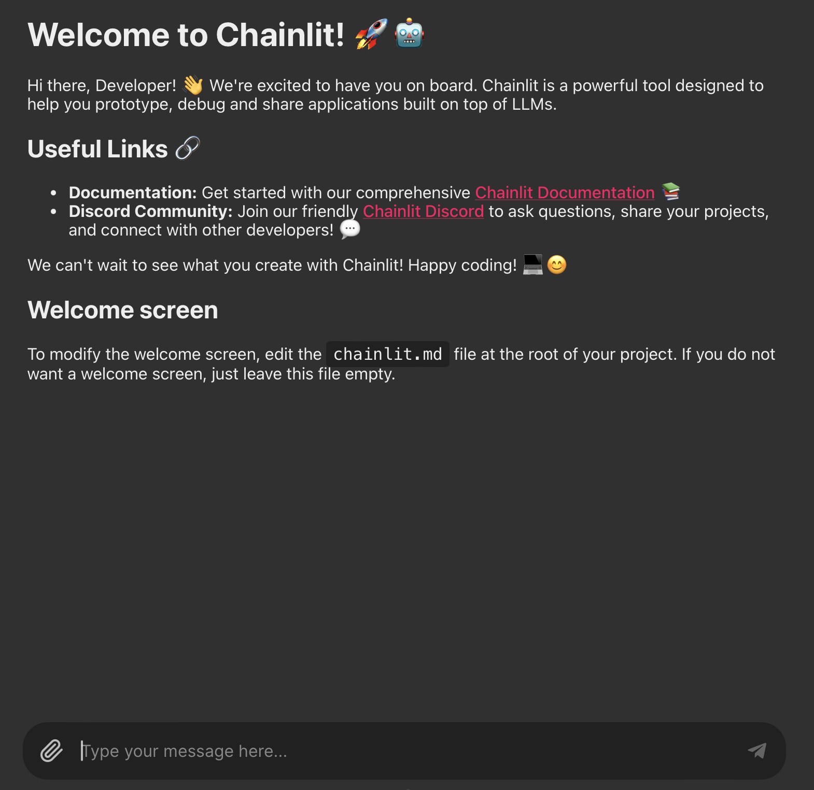


##### 2 PyCharm控制台查看结果

- 启动Chainlit首页成功，查看pycharm控制台，**on_chat_start事件自动触发**

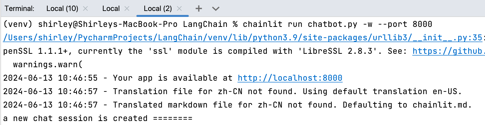


- 任意发送消息，查看pycharm控制条，**on_message事件自动触发**

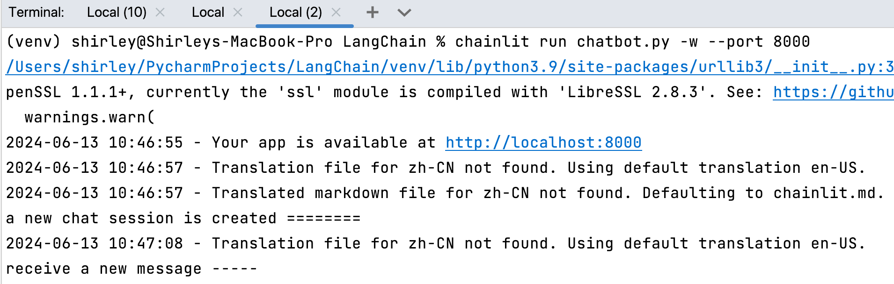


#### 3. 步骤三：创建聊天记忆对象

##### 1 Memory对象

- 在chatbot.py文件内，导入必要的包

  ```python
  from langchain.memory.buffer import ConversationBufferMemory
  ```

- 在函数内，创建memory记忆对象

  ```python
  @cl.on_chat_start
  def query_llm():
      conversation_memory = ConversationBufferMemory(memory_key="chat_history",
                                                     max_len=200,
                                                     return_messages=True,
                                                     )
  ```

##### 2 增加prompt模板

- 在prompt.py文件中，增加包含chat_history的模板

```python
ice_cream_assistant_template = """
You are an ice cream assistant chatbot named "Scoopsie". Your expertise is 
exclusively in providing information and advice about anything related to 
ice creams. This includes flavor combinations, ice cream recipes, and general
ice cream-related queries. You do not provide information outside of this 
scope. If a question is not about ice cream, respond with, "I specialize 
only in ice cream related queries."
Chat History: {chat_history}
Question: {question}
Answer:"""

ice_cream_assistant_prompt_template = PromptTemplate(
    input_variables=["chat_history", "question"],
    template=ice_cream_assistant_template
)
```

- chatbot.py文件中，需要导入prompt 模板

  ```python
  from prompt import ice_cream_assistant_prompt_template
  ```

#### 4. 步骤四：实现事件装饰器

##### 1 on_chat_start事件

- 在query_llm函数中，还需要创建ollama对象，LLMChain对象，同时将LLMChain对象传给user_session

```python
from langchain_community.chat_models import ChatOllama
from langchain.chains import LLMChain

@cl.on_chat_start
def query_llm():
    conversation_memory = ConversationBufferMemory(memory_key="chat_history",
                                                   max_len=200,
                                                   return_messages=True,
                                                   )
    llm = ChatOllama(model="llama3", temperature=0)
    llm_chain = LLMChain(llm=llm, prompt=ice_cream_assistant_prompt_template, memory=conversation_memory)
    cl.user_session.set("llm_chain", llm_chain)
```

##### 2 on_message事件

- 在handle_message函数中，接收用户的消息，并生成response

```python
@cl.on_message
async def handle_message(message: cl.Message):
    llm_chain = cl.user_session.get("llm_chain")

    response = await llm_chain.acall(message.content,
                                     callbacks=[cl.AsyncLangchainCallbackHandler()])

    await cl.Message(response["text"]).send()
```

#### 5. 步骤五：启动Chainlit应用

##### 1 启动chatbot

- 在PyCharm控制台，使用chainlit命令启动聊天机器人

  > chainlit run chatbot.py -w --port 8000

- 浏览器显示默认启动首页结果

  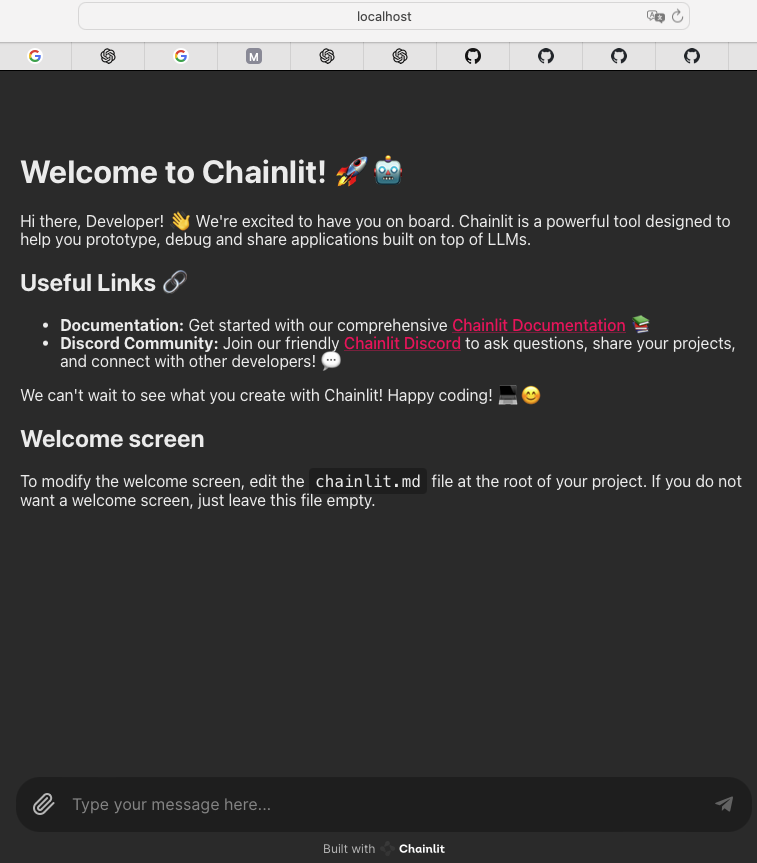

##### 2 查看并修改启动页面

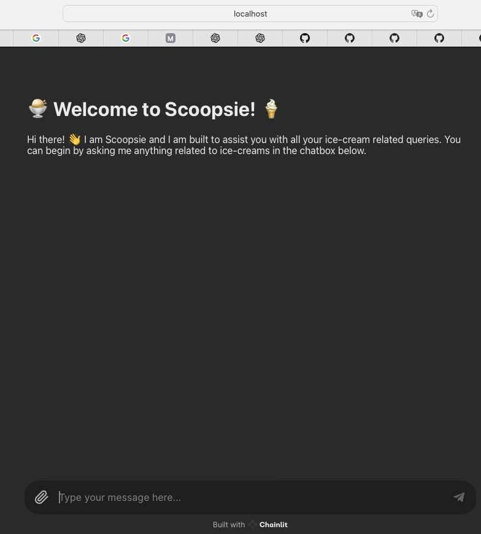

##### 3 修改界面样式

- 选中左边的Settings

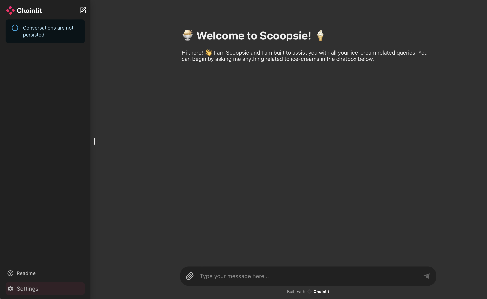


- 关闭“Dark Mode”

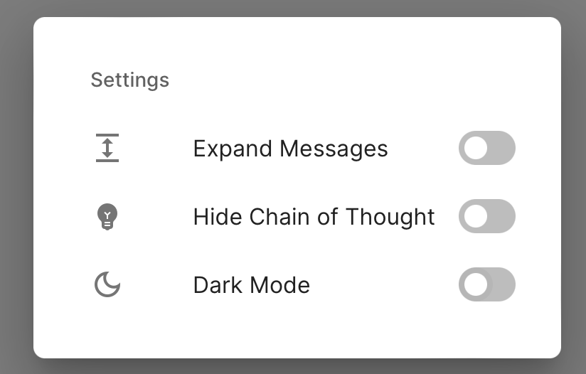

- MUI界面即可改为light样式

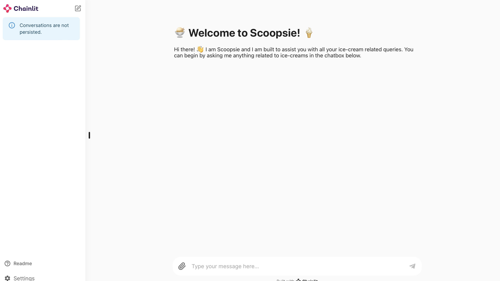


##### 4 验证chatbot

- 输入要提问的问题，例如：“what is your favorite flavor of ice cream”

  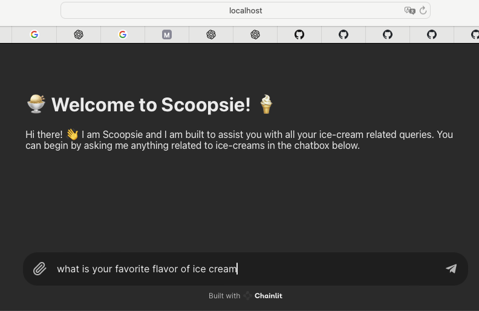

- 等待片刻，可以看到Chatbot聊天机器人的返回结果

  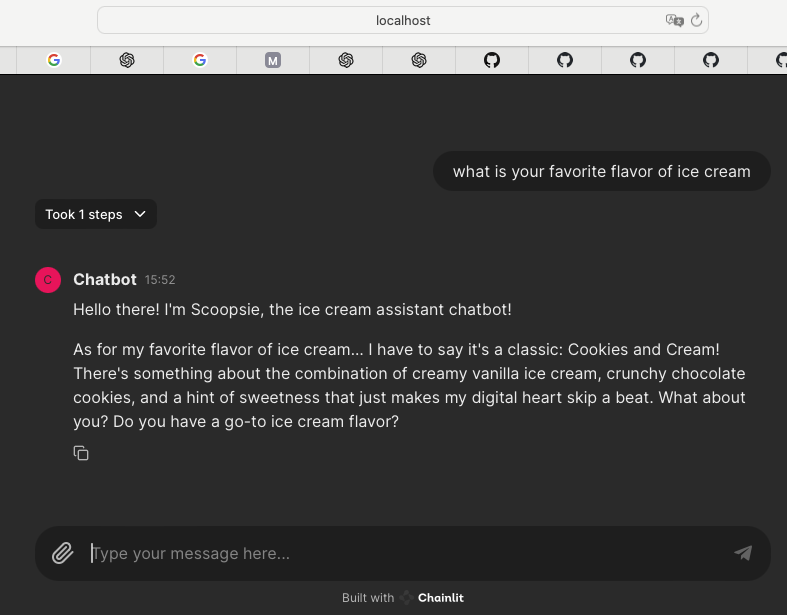

- 可以继续输入相关问题，例如：“what about vanilla flavor”, 大模型返回结果如下图

  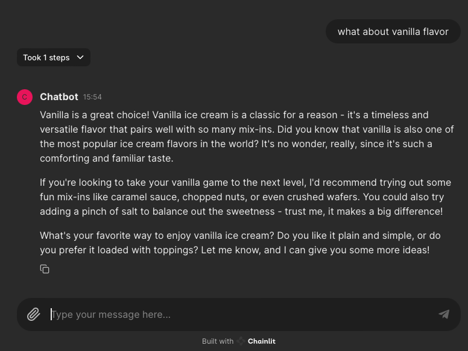


---


### 5. 整合本地web服务的chatbot(拓展一)


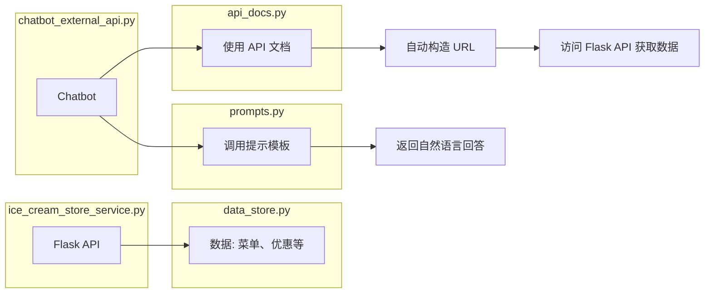
```mermaid
graph LR
    A[Flask API] --> B[数据: 菜单、优惠等]
    C[Chatbot] --> D[使用 API 文档]
    C --> E[调用提示模板]
    D --> F[自动构造 URL]
    F --> G[访问 Flask API 获取数据]
    E --> H[返回自然语言回答]

    subgraph ice_cream_store_service.py
        A
    end

    subgraph data_store.py
        B
    end

    subgraph api_docs.py
        D
    end

    subgraph prompts.py
        E
    end

    subgraph chatbot_external_api.py
        C
    end

```


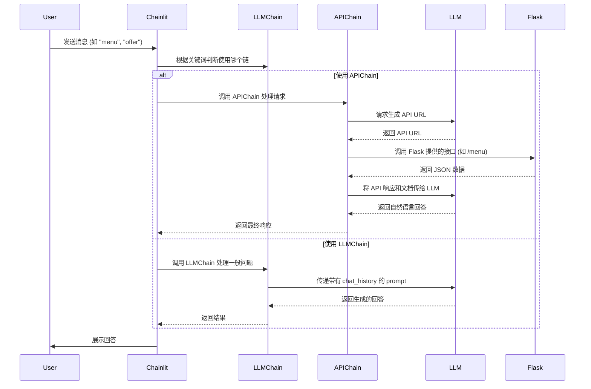
```mermaid
sequenceDiagram
    participant User
    participant Chainlit
    participant LLMChain
    participant APIChain
    participant LLM
    participant Flask

    User->>Chainlit: 发送消息 (如 "menu", "offer")
    Chainlit->>LLMChain: 根据关键词判断使用哪个链
    alt 使用 APIChain
        Chainlit->>APIChain: 调用 APIChain 处理请求
        APIChain->>LLM: 请求生成 API URL
        LLM-->>APIChain: 返回 API URL
        APIChain->>Flask: 调用 Flask 提供的接口 (如 /menu)
        Flask-->>APIChain: 返回 JSON 数据
        APIChain->>LLM: 将 API 响应和文档传给 LLM
        LLM-->>APIChain: 返回自然语言回答
        APIChain-->>Chainlit: 返回最终响应
    else 使用 LLMChain
        Chainlit->>LLMChain: 调用 LLMChain 处理一般问题
        LLMChain->>LLM: 传递带有 chat_history 的 prompt
        LLM-->>LLMChain: 返回生成的回答
        LLMChain-->>Chainlit: 返回结果
    end
    Chainlit->>User: 展示回答
```


#### 1. 步骤一：搭建Flask本地环境

##### 1 实现说明

- 本地搭建Flask环境，模拟冰激凌商店，提供web服务

##### 2 下载安装Flask

- 执行安装命令

  > pip install Flask -i https://pypi.tuna.tsinghua.edu.cn/simple 

#### 2. 步骤二：提供Web服务

##### 1 实现说明

- web服务返回的数据通过data_store.py文件提供（并不是从服务器获取）

##### 2 mock数据

- 手动创建data_store.py文件

  

- 添加对应的数据

```python
# Example menu, special offers, customer reviews, and customizations

menu = {
    "flavors": [
        {"flavorName": "Strawberry", "count": 50},
        {"flavorName": "Chocolate", "count": 75}
    ],
    "toppings": [
        {"toppingName": "Hot Fudge", "count": 50},
        {"toppingName": "Sprinkles", "count": 2000},
        {"toppingName": "Whipped Cream", "count": 50}
    ]
}

special_offers = {
    "offers": [
        {"offerName": "Two for Tuesday", "details": "Buy one get one free on all ice cream flavors every Tuesday."},
        {"offerName": "Winter Wonderland Discount", "details": "25% off on all orders above $20 during the winter season."}
    ]
}

customer_reviews = {
    "reviews": [
        {"userName": "andrew_1", "rating": 5, "comment": "Loved the chocolate flavor!"},
        {"userName": "john", "rating": 4, "comment": "Great place, but always crowded."},
        {"userName": "allison", "rating": 5, "comment": "Love the ice-creams and Scoopsie is super helpful!"}
    ]
}

customizations = {
    "options": [
        {"customizationName": "Sugar-Free", "details": "Available for most flavors."},
        {"customizationName": "Extra Toppings", "details": "Choose as many toppings as you want for an extra $5!"}
    ]
}
```

##### 3 创建Flask应用

- 手动创建ice_cream_store_service.py

  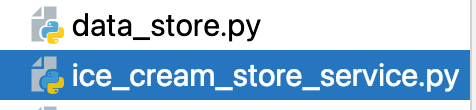

- 添加代码

  ```python
  from flask import Flask, jsonify
  from data_store import menu, special_offers, customer_reviews, customizations
  
  app = Flask(__name__)
  
  
  @app.route('/menu', methods=['GET'])
  def get_menu():
      """
      Retrieves the menu data.
  
      Returns:
          A tuple containing the menu data as JSON and the HTTP status code.
      """
      return jsonify(menu), 200
  
  
  @app.route('/special-offers', methods=['GET'])
  def get_special_offers():
      """
      Retrieves the special offers data.
  
      Returns:
          A tuple containing the special offers data as JSON and the HTTP status code.
      """
      return jsonify(special_offers), 200
  
  
  @app.route('/customer-reviews', methods=['GET'])
  def get_customer_reviews():
      """
      Retrieves customer reviews data.
  
      Returns:
          A tuple containing the customer reviews data as JSON and the HTTP status code.
      """
      return jsonify(customer_reviews), 200
  
  
  @app.route('/customizations', methods=['GET'])
  def get_customizations():
      """
      Retrieves the customizations data.
  
      Returns:
          A tuple containing the customizations data as JSON and the HTTP status code.
      """
      return jsonify(customizations), 200
  
  
  if __name__ == '__main__':
      app.run(debug=True)
  ```


##### 4 验证web服务

- 运行ice_cream_store_service.py，控制台显示如下日志信息

  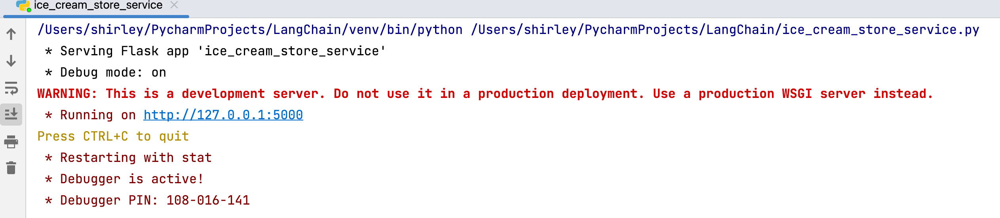

- 浏览器输入URL地址：http://127.0.0.1:5000/menu

  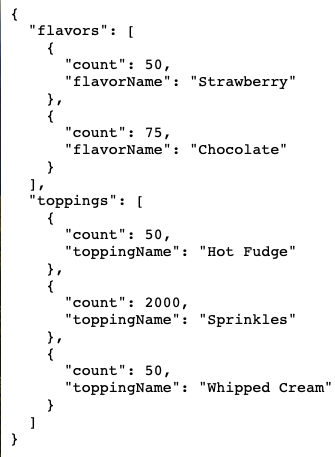

  

#### 3. 步骤三：创建prompt模板

##### 1 创建PromptTemplate对象

- 手动创建prompts.py文件，添加下面代码

  ```python
  from langchain.prompts import PromptTemplate
  
  api_url_template = """
  Given the following API Documentation for Scoopsie's official ice cream store API: {api_docs}
  Your task is to construct the most efficient API URL to answer the user's question.
  Return ONLY the exact URL without any additional text, explanation, or formatting.
  Question: {question}
  API URL:
  """
  api_url_prompt = PromptTemplate(input_variables=['api_docs', 'question'],
                                  template=api_url_template)
  
  api_response_template = """"
  With the API Documentation for Scoopsie's official API: {api_docs} and the specific user question: {question} in mind,
  and given this API URL: {api_url} for querying, here is the response from Scoopsie's API: {api_response}. 
  Please provide a summary that directly addresses the user's question, 
  omitting technical details like response format, and focusing on delivering the answer with clarity and conciseness, 
  as if Scoopsie itself is providing this information.
  Summary:
  """
  api_response_prompt = PromptTemplate(input_variables=['api_docs', 'question', 'api_url',
                                                        'api_response'],
                                       template=api_response_template)
  ```


#### 4. 步骤四：创建聊天机器人

##### 1 构建前后端api交互对象

- 为了前端chainlit和后端Flask服务交互，创建api_docs.py文件

  

- 在该文件内添加代码

  ```python
  import json
  
  scoopsie_api_docs = {
      "base_url": "http://127.0.0.1:5000/",
      "endpoints": {
          "/menu": {
              "method": "GET",
              "description": "Retrieve the menu of flavors and customizations.",
              "parameters": None,
              "response": {
                  "description": "A JSON object containing available flavors and toppings along with their counts.",
                  "content_type": "application/json"
              }
          },
          "/special-offers": {
              "method": "GET",
              "description": "Retrieve current special offers and discounts.",
              "parameters": None,
              "response": {
                  "description": "A JSON object listing the current special offers and discounts.",
                  "content_type": "application/json"
              }
          },
          "/customer-reviews": {
              "method": "GET",
              "description": "Retrieve customer reviews for the ice cream store.",
              "parameters": None,
              "response": {
                  "description": "A JSON object containing customer reviews, ratings, and comments.",
                  "content_type": "application/json"
              }
          },
          "/customizations": {
              "method": "GET",
              "description": "Retrieve available ice cream customizations.",
              "parameters": None,
              "response": {
                  "description": "A JSON object listing available customizations like toppings and sugar-free options.",
                  "content_type": "application/json"
              }
          }
      }
  }
  
  scoopsie_api_docs = json.dumps(scoopsie_api_docs, indent=2)
  ```


##### 2 构建聊天机器人

- 手动创建chatbot_external_api.py文件

- 在该文件内添加代码

```python
from langchain_openai import OpenAI
from langchain.chains import LLMChain, APIChain
from prompts import ice_cream_assistant_prompt, api_response_prompt, api_url_prompt
from langchain.memory.buffer import ConversationBufferMemory
from api_docs import scoopsie_api_docs
import chainlit as cl
from langchain_community.chat_models import ChatOllama


@cl.on_chat_start
def setup_multiple_chains():
    llm = ChatOllama(model="llama3", temperature=0)
    conversation_memory = ConversationBufferMemory(memory_key="chat_history",
                                                   max_len=200,
                                                   return_messages=True,
                                                   )
    llm_chain = LLMChain(llm=llm, prompt=ice_cream_assistant_prompt, memory=conversation_memory)
    cl.user_session.set("llm_chain", llm_chain)

    api_chain = APIChain.from_llm_and_api_docs(
        llm=llm,
        api_docs=scoopsie_api_docs, # 描述可用的 API 接口信息
        api_url_prompt=api_url_prompt, # 指导模型生成 API URL
        api_response_prompt=api_response_prompt, # 指导模型将 API 响应转为自然语言
        verbose=True,
        limit_to_domains=["http://127.0.0.1:5000/"] # 白名单域名，防止调用非法 API
    )
    cl.user_session.set("api_chain", api_chain)


@cl.on_message
async def handle_message(message: cl.Message):
    user_message = message.content.lower()
    llm_chain = cl.user_session.get("llm_chain")
    api_chain = cl.user_session.get("api_chain")

    if any(keyword in user_message for keyword in ["menu", "customization",
                                                   "offer", "review"]):
        # If any of the keywords are in the user_message, use api_chain
        response = await api_chain.acall(user_message,
                                         callbacks=[cl.AsyncLangchainCallbackHandler()])
    else:
        # Default to llm_chain for handling general queries
        response = await llm_chain.acall(user_message,
                                         callbacks=[cl.AsyncLangchainCallbackHandler()])

    response_key = "output" if "output" in response else "text"
    await cl.Message(response.get(response_key, "")).send()
```


####  5. 步骤五：启动验证聊天机器人

##### 1 实现说明

- 本实验提供三个prompt模板，通过chainlit搭建web应用，完成用户的聊天功能

##### 2 启动chatbot

- 使用chainlit命令启动聊天机器人

  > chainlit run chatbot.py -w --port 8000

- 浏览器显示默认启动首页结果

  

##### 3 验证chatbot

- 输入要提问的问题，例如：“what is your favorite flavor of ice cream”

  

- 等待片刻，可以看到Chatbot聊天机器人的返回结果

  

- 可以继续输入相关问题，例如：“what about vanilla flavor”, 大模型返回结果如下图

  


---


## 八. LangChain Agent


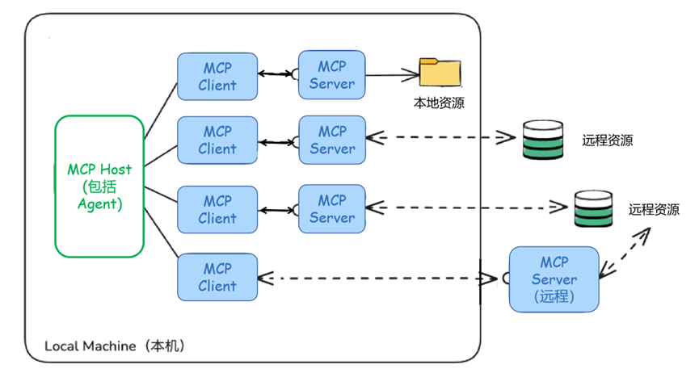


https://www.zhihu.com/question/14871840737/answer/1906386829193749087


### 1. Pydantic Agent

#### 测试文件

a

```python
name = input("What's your name? ")
print(f"Hello, {name}!")
```

b

```c++
#include <iostream>

int main() {
    auto message = "Hello, World!";  // 使用auto自动推导类型
    std::cout << message << '\n';    // 使用'\n'替代std::endl提高效率
}
```

c

```java
public class HelloWorld {
    public static void main(String[] args) {
        System.out.println("Hello, World!");
    }
}
```


#### tools

```python
from pathlib import Path
import os

base_dir = Path("./test")


def read_file(name: str) -> str:
    """Return file content. If not exist, return error message.
    """
    print(f"(read_file {name})")
    try:
        with open(base_dir / name, "r", encoding="utf-8") as f:
            content = f.read()
        return content
    except Exception as e:
        return f"An error occurred: {e}"

def list_files() -> list[str]:
    print("(list_file)")
    file_list = []
    for item in base_dir.rglob("*"):
        if item.is_file():
            file_list.append(str(item.relative_to(base_dir)))
    return file_list

def rename_file(name: str, new_name: str) -> str:
    print(f"(rename_file {name} -> {new_name})")
    try:
        new_path = base_dir / new_name
        if not str(new_path).startswith(str(base_dir)):
            return "Error: new_name is outside base_dir."

        os.makedirs(new_path.parent, exist_ok=True)
        os.rename(base_dir / name, new_path)
        return f"File '{name}' successfully renamed to '{new_name}'."
    except Exception as e:
        return f"An error occurred: {e}"
```


#### Main

```python
from pydantic_ai import Agent
from pydantic_ai.models.openai import OpenAIModel
from pydantic_ai.providers.openai import OpenAIProvider
from dotenv import load_dotenv
import tools

load_dotenv()

deepseek_provider = OpenAIProvider(
    base_url='https://api.deepseek.com',
    # api_key='<填入你的api key>'
)
model = OpenAIModel(
    'deepseek-chat',
    provider=deepseek_provider
)
agent = Agent(model,
              system_prompt="You are an experienced programmer",
              tools=[tools.read_file, tools.list_files, tools.rename_file])

def main():
    history = []
    while True:
        user_input = input("Input: ")
        resp = agent.run_sync(user_input,
                              message_history=history)
        history = list(resp.all_messages())
        print(resp.output)


if __name__ == "__main__":
    main()

```

> 【原来写一个 AI Agent 这么简单】 https://www.bilibili.com/video/BV1UMVKzEESL/?share_source=copy_web&vd_source=08c1ac4ad48919ebac32a94a83defc52


### 2. LangChain Agent

#### 1. 什么是ReAct代理？

ReAct代理是一种结合了：
- **推理(Reasoning)**：思考下一步该做什么
- **行动(Acting)**：执行具体操作（如调用工具）

这种模式使代理能够处理需要多步推理和操作的任务，比简单的动作-响应模式更智能。

#### 2. LangChain Agent基本使用步骤

##### 1. zero-shot-react-description

zero-shot-react-description是 LangChain 中一种 无需示例（Zero-Shot） 的 ReAct 代理类型，它通过纯自然语言描述（Description）驱动工具的使用。

```python
from langchain_community.agent_toolkits.load_tools import load_tools
from langchain.agents import initialize_agent, Tool

# 初始化LLM
from langchain_openai.chat_models.base import BaseChatOpenAI
llm = BaseChatOpenAI(
    model='deepseek-chat',
    # openai_api_key='sk-111111111111112222222222222',
    openai_api_base='https://api.deepseek.com',
    max_tokens=1024
)

# 初始化LLM和工具
tools = load_tools(["llm-math"], llm=llm)  # 基础计算器工具

# 添加自定义工具（如百度搜索）
def custom_search(query: str) -> str:
    return "模拟搜索结果: " + query

tools.append(
    Tool(name="Search", func=custom_search, description="通用搜索工具")
)

# 使用通用ReAct代理
agent = initialize_agent(
    tools,
    llm,
    agent="zero-shot-react-description",  
    verbose=True
)

agent.run("3的平方是多少？")
```

##### 2. 代码执行结果

```cmd
> Entering new AgentExecutor chain...
Thought: 我需要计算3的平方，这是一个简单的数学问题，可以使用计算器来解决。
Action: Calculator
Action Input: 3**2
Observation: Answer: 9
Thought:I now know the final answer
Final Answer: 3的平方是9。

> Finished chain.
```

##### 3. 各组件协作流程

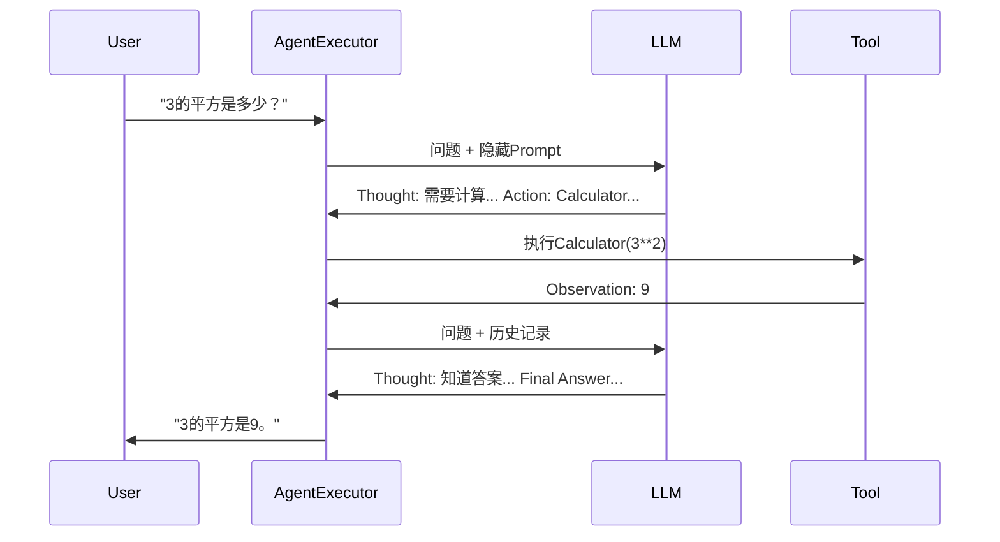
```mermaid
sequenceDiagram
    participant User
    participant AgentExecutor
    participant LLM
    participant Tool

    User->>AgentExecutor: "3的平方是多少？"
    AgentExecutor->>LLM: 问题 + 隐藏Prompt
    LLM->>AgentExecutor: Thought: 需要计算... Action: Calculator...
    AgentExecutor->>Tool: 执行Calculator(3**2)
    Tool->>AgentExecutor: Observation: 9
    AgentExecutor->>LLM: 问题 + 历史记录
    LLM->>AgentExecutor: Thought: 知道答案... Final Answer...
    AgentExecutor->>User: "3的平方是9。"
```


---

### 3. 创意小项目

---

#### 🧠 1. 智能文件管家
```python
agent = Agent(
    model,
    system_prompt='你是高级文件管理助手，擅长自动化整理文件',
    tools=[
        tools.organize_files_by_type,  # 按类型整理文件
        tools.find_duplicate_files,    # 查找重复文件
        tools.batch_rename_files,      # 批量重命名
        tools.compress_folder          # 文件夹压缩
    ]
)
```
**功能示例**  
- "把下载文件夹里的图片移到Pictures目录"  
- "查找C盘所有重复的PDF文件"  
- "将project文件夹压缩为zip"

---

#### 📊 2. 数据小助手
```python
agent = Agent(
    model,
    system_prompt='你是数据分析专家，擅长处理CSV/Excel数据',
    tools=[
        tools.read_csv_file,          # 读取CSV
        tools.generate_excel_chart,    # 生成图表
        tools.filter_dataset,          # 数据筛选
        tools.merge_excel_files        # 合并Excel
    ]
)
```
**功能示例**  
- "分析sales.csv，找出销售额最高的产品"  
- "把这两个Excel文件按日期合并"  
- "生成每月销量的柱状图"

---

#### 🌐 3. 网页小工具
```python
agent = Agent(
    model,
    system_prompt='你是网页操作专家，擅长自动化网页任务',
    tools=[
        tools.scrape_website,          # 网页抓取
        tools.monitor_webpage_change,   # 网页变更监控
        tools.fill_web_form,            # 自动填表
        tools.download_web_images       # 下载图片
    ]
)
```
**功能示例**  
- "抓取知乎热榜前10标题"  
- "监控这个商品页的价格变化"  
- "自动填写这个注册表单"

---

#### 📝 4. 写作小助手
```python
agent = Agent(
    model,
    system_prompt='你是创意写作助手，擅长文本生成和润色',
    tools=[
        tools.generate_poem,          # 生成诗歌
        tools.rephrase_text,           # 文本润色
        tools.summarize_document,      # 文档摘要
        tools.translate_text           # 文本翻译
    ]
)
```
**功能示例**  
- "写一首关于春天的七言诗"  
- "把这段文字改得更正式些"  
- "将这篇英文文章摘要成中文"

---

#### 🔧 5. 系统优化小工具
```python
agent = Agent(
    model,
    system_prompt='你是Windows系统优化专家',
    tools=[
        tools.clean_temp_files,        # 清理临时文件
        tools.analyze_disk_usage,      # 磁盘分析
        tools.optimize_startup,        # 开机优化
        tools.monitor_system_resources # 资源监控
    ]
)
```
**功能示例**  
- "清理所有临时文件"  
- "找出占用C盘最大的10个文件"  
- "禁用不必要的开机启动项"

> C:\Users\qingy\AppData

---


## 九. RAG

### 1. 文本向量化与向量数据库

#### 导入相关模块

```python
import chromadb
from langchain_ollama import OllamaEmbeddings
```


#### 创建数据库和Embedding模型实例

```python
chromadb_client = chromadb.PersistentClient("./chroma.db")
chromadb_collection = chromadb_client.get_or_create_collection("rag_tiny")

ollama_emb = OllamaEmbeddings(model="nomic-embed-text")
```


#### 知识向量化后存储

```python
def create_db(documents: list[str]) -> None:
    r1 = ollama_emb.embed_documents(documents)
    print("embed:",r1)
    chromadb_collection.upsert (
        ids=["1", "2"],
        documents=documents,
        embeddings=r1
    )
```


#### 问题向量化后查询

```python
def query_db(question: str) -> list[str]:
    r2 = ollama_emb.embed_query(question)
    print("query:",r2)
    result = chromadb_collection.query(
        query_embeddings=r2,
        n_results=1
    )
    return result["documents"][0]
```

#### 向量查询测试

```python
if __name__ == '__main__':
    documents = ["Alpha is the first letter of Greek alphabet",
                 "Beta is the second letter of Greek alphabet", ]

    question = "What is the second letter of Greek alphabet"

    create_db(documents)
    print("=================================================")
    chunks = query_db(question)
    print("=================================================")
    print(chunks)
```


#### 向量可视化

**导入相关模块**

```python
import matplotlib.pyplot as plt
from sklearn.decomposition import PCA
# 设置支持中文的字体
plt.rcParams["font.family"] = ["SimHei"]
plt.rcParams['axes.unicode_minus'] = False
```

**可视化**

```python
def vector_visual(embeddings,  texts):
    
    pca = PCA(n_components=2)
    reduced = pca.fit_transform(embeddings)

    # 可视化
    fig = plt.figure(figsize=(12, 8))
    ax = fig.add_subplot(111)
    for i, (x, y) in enumerate(reduced):
        ax.scatter(x, y, color='blue')
        ax.text(x + 0.02, y + 0.02, texts[i][:10], fontsize=9)
    ax.set_aspect('equal')
    plt.show()
```

**提取部分向量**

```
embeddings = chromadb_collection.get(include=["embeddings"])["embeddings"][:50]
texts = chromadb_collection.get(include=["documents"])["documents"][:50]
vector_visual(embeddings, texts)
```


### 2. RAG 应用

#### 数据集ETL

```python
import os

# 输入和输出文件夹路径
input_folder = '西游记白话文'
output_folder = 'output'

# 确保输出文件夹存在
os.makedirs(output_folder, exist_ok=True)

# 遍历输入文件夹中的所有文件
for filename in os.listdir(input_folder):
    if filename.endswith('.txt'):
        # 构建文件路径
        input_file_path = os.path.join(input_folder, filename)
        
        # 读取文件内容
        with open(input_file_path, 'r', encoding='utf-8') as file:
            lines = file.readlines()
        
        # 去除每行的前后空格
        lines = [line.strip() for line in lines]
        
        # 获取新的文件名（原文件的第一行）
        new_filename = lines[0] + '.txt'
        output_file_path = os.path.join(output_folder, new_filename)
        
        # 替换第一行
        lines[0] = new_filename
        
        # 将修改后的内容写入输出文件
        with open(output_file_path, 'w', encoding='utf-8') as file:
            file.write('\n'.join(lines) + '\n')

print("所有文件已处理并保存到 output 文件夹中。")
```

#### 数据分块

```python
# 导入必要的包
from langchain_ollama import OllamaEmbeddings
from langchain.text_splitter import RecursiveCharacterTextSplitter
from langchain_community.vectorstores import FAISS
from langchain_community.document_loaders import TextLoader
from tqdm import tqdm
import logging
from pathlib import Path

# 配置日志
logging.basicConfig(level=logging.INFO)
logger = logging.getLogger(__name__)

# 加载output目录下的所有文本文件
logger.info("开始加载文档...")
output_dir = Path("output")
source_docs = []
for file_path in output_dir.glob("*.txt"):
    try:
        loader = TextLoader(str(file_path), encoding='utf-8')
        source_docs.extend(loader.load())
        logger.info(f"已加载文件: {file_path.name}")
    except Exception as e:
        logger.error(f"加载文件 {file_path} 时出错: {str(e)}")

logger.info(f"共加载了 {len(source_docs)} 个文档")

# Initialize the text splitter
# text_splitter = RecursiveCharacterTextSplitter.from_huggingface_tokenizer(
text_splitter = RecursiveCharacterTextSplitter(
    # tokenizer,
    chunk_size=200,
    chunk_overlap=20,
    add_start_index=True,
    strip_whitespace=True,
    separators=["\n\n", "\n", ".", " ", ""],
)

# Split documents and remove duplicates
logger.info("开始分割文档...")
docs_processed = []
unique_texts = {}
for doc in tqdm(source_docs):
    new_docs = text_splitter.split_documents([doc])
    for new_doc in new_docs:
        if new_doc.page_content not in unique_texts:
            unique_texts[new_doc.page_content] = True
            docs_processed.append(new_doc)

logger.info(f"已处理 {len(docs_processed)} 个唯一文档块")

# Initialize the embedding model
logger.info("正在初始化嵌入模型...")
embedding_model = OllamaEmbeddings(model="nomic-embed-text")


# Create the vector database
logger.info("正在创建向量数据库...")
vectordb = FAISS.from_documents(
    documents=docs_processed,
    embedding=embedding_model
)

logger.info("向量数据库创建成功")

vectordb.save_local("vector_db")
logger.info("向量数据库保存成功")
```


#### RAG

```python
from langchain_ollama import OllamaEmbeddings
from langchain_community.vectorstores import FAISS
import logging

# 配置日志
logging.basicConfig(level=logging.INFO)
logger = logging.getLogger(__name__)


logger.info("正在初始化嵌入模型...")
embedding_model = OllamaEmbeddings(model="nomic-embed-text")

# 加载本地存储的向量数据库
logger.info("正在加载向量数据库...")
vectordb = FAISS.load_local("vector_db", embeddings=embedding_model, allow_dangerous_deserialization=True)
logger.info("向量数据库加载成功")

from langchain_openai.chat_models.base import BaseChatOpenAI

model = BaseChatOpenAI(
    model='deepseek-chat',
    # openai_api_key='sk-111111111111112222222222222',
    openai_api_base='https://api.deepseek.com',
    max_tokens=1024
)


def retriever(query:str)->str:
    """
    根据用户的查询，执行向量数据库的相似性搜索，并返回结果的字符串表示形式。

    Args:
        query: 要查询的字符串。此字符串将用于在向量数据库中进行相似性搜索。

    """
    logger.info(f"正在查询: {query}")
    results = vectordb.similarity_search(query, k=5)  # k 是返回的结果数量
    logger.info("查询完成")

    # 将结果组合成一个字符串
    combined_results = "\n\n".join([f"资料{i+1}: {result.page_content}" for i, result in enumerate(results)])
    return combined_results


question = "孙悟空有两个师傅,他们分别是谁?"

context = retriever(question)

naive_agent_prompt = f"""
根据下面的问题和支持文档，给出一个全面的答案。
只回答所问的问题，回答应该简洁且与问题相关。
如果你无法找到信息，就如实回答。

Question:
{question}

{context}
    """

logger.info(f"naive_agent_prompt完整提示词:\n {naive_agent_prompt}")

a = model.invoke( input=[{"role": "user", "content": naive_agent_prompt}] )
logger.info(a.content)
```


## 十. MCP

### 1. RAG局限性

RAG，即检索增强生成（Retrieval-Augmented Generation），是目前大模型领域的一个热门方向。它将信息检索技术与生成式模型相结合，解决大模型在知识准确性、上下文理解以及对最新信息的利用等方面的难题。

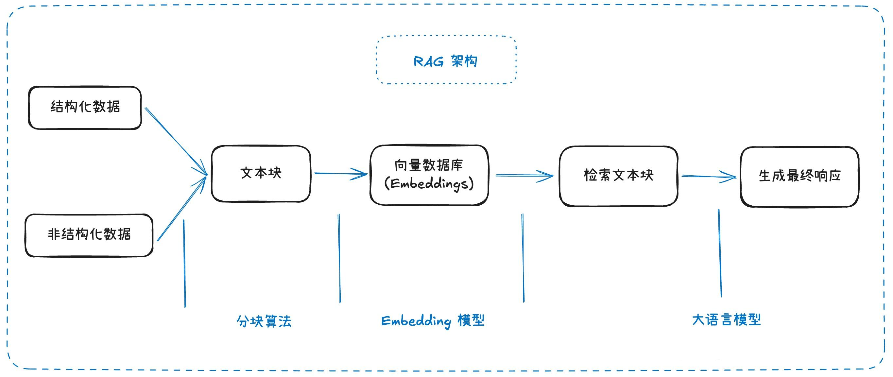

**RAG技术流程**：RAG 最核心的就是先将知识转换成 “向量“ ，导入 “向量数据库“，然后在将用户输入的信息也转换成 “向量” ，然后再去向量数据库匹配出相似的 “向量“，最后再由大模型去总结检索到的内容。

从`RAG`本身技术原理的角度出发，目前存在着以下问题：

- **检索精度不足**：RAG中，大模型仅仅起到了总结的作用，而检索到信息的精准度大部分情况下取决于检索算法（召回→ 排序），检索结果可能包含无关内容（低精确率）或遗漏关键信息（低召回率）。
- **生成内容不完整**：由于 RAG 处理的是文档的切片，而切片的局部性注定了它无法看到整篇文档的信息。
- **缺乏大局观**：RAG 无法判断需要多少个切片才能回答问题，也无法判断文档间的联系。
- **多轮检索能力弱**：RAG 缺乏执行多轮、多查询检索的能力，而这对推理任务来说是必不可少的。

尽管近期也有些新出现的技术，如`GraphRAG、KAG`等能够在一定程度上解决这些问题，但都还不成熟，目前的 RAG 技术还远远达不到我们预期想要的效果。

### 2. MCP vs Function Call

|            | Function Calling           | MCP                             |
| ---------- | -------------------------- | ------------------------------- |
| 协议标准   | 私有协议（各模型自订规则） | 开放协议（JSON-RPC 2.0）        |
| 工具发现   | 动态请求                   | 静态预定义                      |
| 调用方式   | 同进程函数或API            | Stdio/SSE同进程                 |
| 扩展成本   | 高（新增工具需要调整模型） | 低（工具热插拔，模型无需改动）  |
| 适用场景   | 简单任务（单次函数调用）   | 复杂流程（多工具协同+数据交互） |
| 工程复杂度 | 低（快速接入单个工具）     | 高（需部署MCP服务器+客户端）    |
| 生态协作   | 工具与模型强绑定           | 工具开发者与Agent开发者解耦     |

### 3. MCP(Model Context Protocol)

MCP（`Model Context Protocol`，模型上下文协议）是一种由`Anthropic` [ænˈθrɑːpɪk] 公司（也就是开发 Claude 模型的公司）推出的一个开放标准协议，目的就是为了解决 AI 模型与外部数据源、工具交互的难题。


通过`Function Call`，每次要让模型连接新的数据源或使用新工具，开发者都得专门编写大量代码来进行对接，既麻烦又容易出错。而`MCP`的出现就是为了解决这些问题，它就像是一个 “通用插头” 或者 “USB 接口”，制定了统一的规范，不管是连接数据库、第三方 API，还是本地文件等各种外部资源，都可以通过这个 “通用接口” 来完成，让 AI 模型与外部工具或数据源之间的交互更加标准化、可复用。

MCP Host，比如 Claude Desktop、Cursor 这些工具，在内部实现了 MCP Client，然后 MCP Client 通过标准的 MCP 协议和 MCP Server 进行交互，由各种三方开发者提供的 MCP Server 负责实现各种和三方资源交互的逻辑，比如访问数据库、浏览器、本地文件，最终再通过 标准的 MCP 协议返回给 MCP Client，最终在 MCP Host 上展示。

开发者按照 MCP 协议进行开发，无需为每个模型与不同资源的对接重复编写适配代码，可以大大节省开发工作量，另外已经开发出的 MCP Server，因为协议是通用的，能够直接开放出来给大家使用，这也大幅减少了开发者的重复劳动。

比如，你如果想开发一个同样逻辑的插件，你不需要在 Coze 写一遍，再去 Dify 写一遍，如果它们都支持了 MCP，那就可以直接使用同一个插件逻辑。

在整个MCP的应用场景中，整体架构如下：

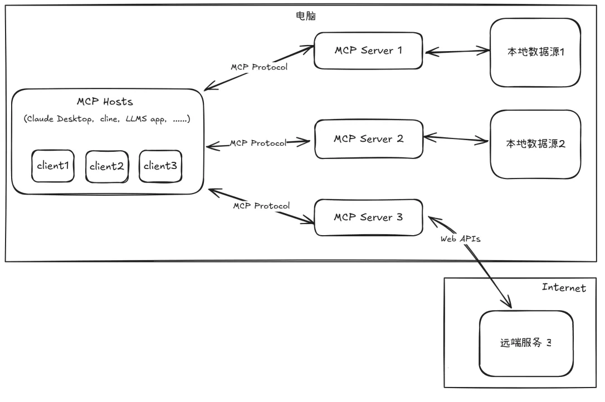

- **MCP Hosts**: 希望通过 MCP 访问数据的程序，如 Claude Desktop、Cline等开发工具或AI应用
- **MCP Clients**: 与服务器保持 1:1 连接的协议客户端
- **MCP Servers**: 轻量级程序，每个程序通过标准化的Model Context Protocol (MCP)暴露特定的能力
- **本地数据源（Local Data Sources）**: 您计算机中，MCP 服务器可以安全访问的文件、数据库和服务
- **远程服务（Remote Services）**: 可以通过互联网（例如，通过 API）访问的外部系统，MCP 服务器可以连接到这些系统


#### 1. MCP客户端（Host）

在 MCP 官方文档中，看到已经支持了 MCP 协议的一些客户端/工具列表：

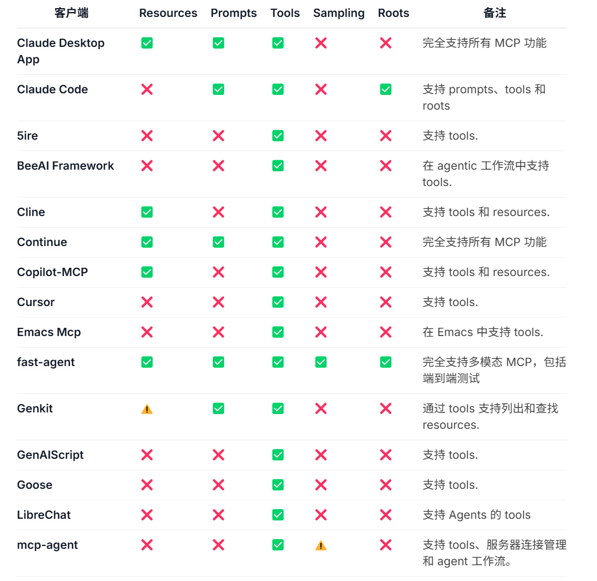

从表格里，可以看到，MCP 对支持的客户端划分了五大能力，这里先简单了解即可：

- **Tools**：服务器暴露可执行功能，供 LLM 调用以与外部系统交互。
- **Resources**：服务器暴露数据和内容，供客户端读取并作为 LLM 上下文。
- **Prompts**：服务器定义可复用的提示模板，引导 LLM 交互。
- **Sampling**：让服务器借助客户端向 LLM 发起完成请求，实现复杂的智能行为。
- **Roots**：客户端给服务器指定的一些地址，用来告诉服务器该关注哪些资源和去哪里找这些资源。

目前最常用，并且被支持最广泛的就是`Tools`工具调用。

对于上面这些已经支持 MCP 的工具，其实整体划分一下就是这么几类：

- AI 聊天工具：如 5ire、LibreChat、Cherry Studio
- AI 编码工具：如 Cursor、Windsurf、Cline
- AI 开发框架：如 Genkit、GenAIScript、BeeAI

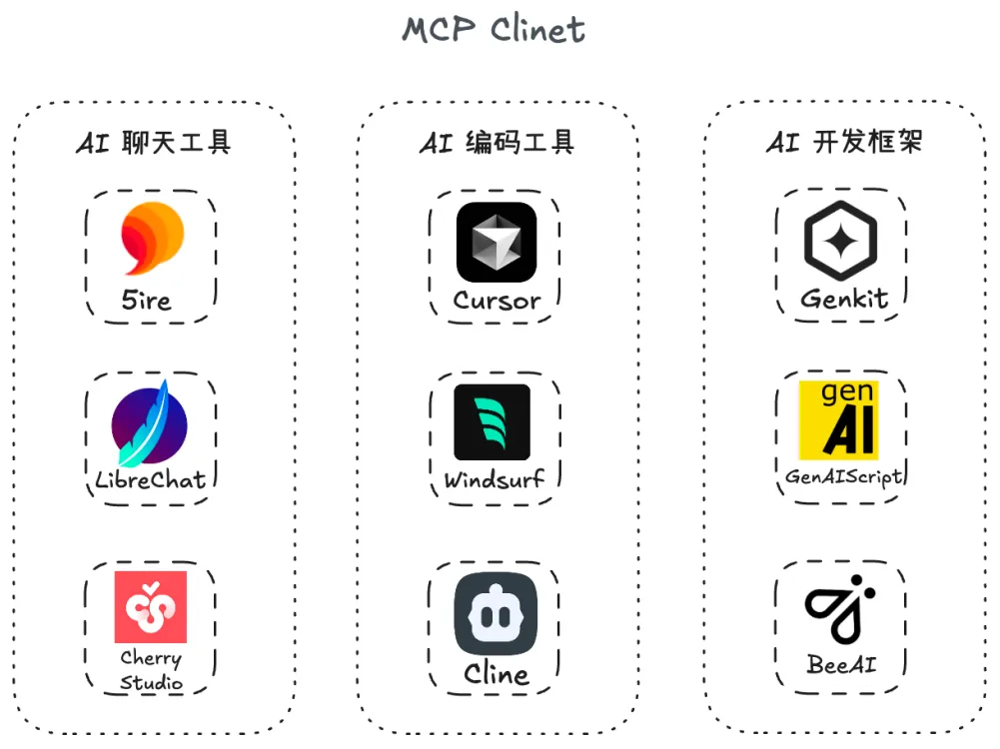

#### 2. MCP Server

`MCP Server`的官方描述：一个轻量级程序，每个程序都通过标准化模型上下文协议公开特定功能。

简单理解，就是通过标准化协议与客户端交互，能够让模型调用特定的数据源或工具功能。常见的`MCP Server`有：

- **文件和数据访问类**：让大模型能够操作、访问本地文件或数据库，如 File System MCP Server；
- **Web 自动化类**：让大模型能够操作浏览器，如 Pupteer MCP Server；
- **三方工具集成类**：让大模型能够调用三方平台暴露的 API，如 高德地图 MCP Server；

下面是一些可以查找到你需要的`MCP Server`的途径：

- [MCP Server Github](https://github.com/modelcontextprotocol/servers "MCP Server Github")：官方的`MCP Server`集合 Github 仓库，里面包含了作为官方参考示例的`MCP Server`、被官方集成的`MCP Server`以及一些社区开发的第三方`MCP Server`。
- [MCP.so](http://MCP.so "MCP.so")：一个三方的 MCP Server 聚合平台，目前收录了 5000+ MCP Server。
- [MCP Market](https://mcpmarket.cn "MCP Market")：访问速度不错，可以按工具类型筛选。


### 4. MCP Hello World

**tools.py**

```python
import platform
import psutil
import subprocess
import json


def get_host_info() -> str:
    """get host information
    Returns:
        str: the host information in JSON string
    """
    info: dict[str, str] = {
        "system": platform.system(),
        "release": platform.release(),
        "machine": platform.machine(),
        "processor": platform.processor(),
        "memory_gb": str(round(psutil.virtual_memory().total / (1024 ** 3), 2)),
    }

    cpu_count = psutil.cpu_count(logical=True)
    if cpu_count is None:
        info["cpu_count"] = "-1"
    else:
        info["cpu_count"] = str(cpu_count)

    try:
        cpu_model = subprocess.check_output(
            ["sysctl", "-n", "machdep.cpu.brand_string"]
        ).decode().strip()
        info["cpu_model"] = cpu_model
    except Exception:
        info["cpu_model"] = "Unknown"

    return json.dumps(info, indent=4)


if __name__ == '__main__':
    print(get_host_info())
```


**ai-mcp-demo**

```python
# main.py
from mcp.server.fastmcp import FastMCP
import tools

mcp = FastMCP("host info mcp")
mcp.add_tool(tools.get_host_info)


@mcp.tool()
def foo():
    return ""


def main():
    mcp.run("stdio")  # sse


if __name__ == "__main__":
    main()
```

> 【8分钟教会你写 MCP】 https://www.bilibili.com/video/BV1nyVDzaE1x/?share_source=copy_web&vd_source=08c1ac4ad48919ebac32a94a83defc52


### 5. JetBrainsLingma 中配置MCP


1. MCP 工具

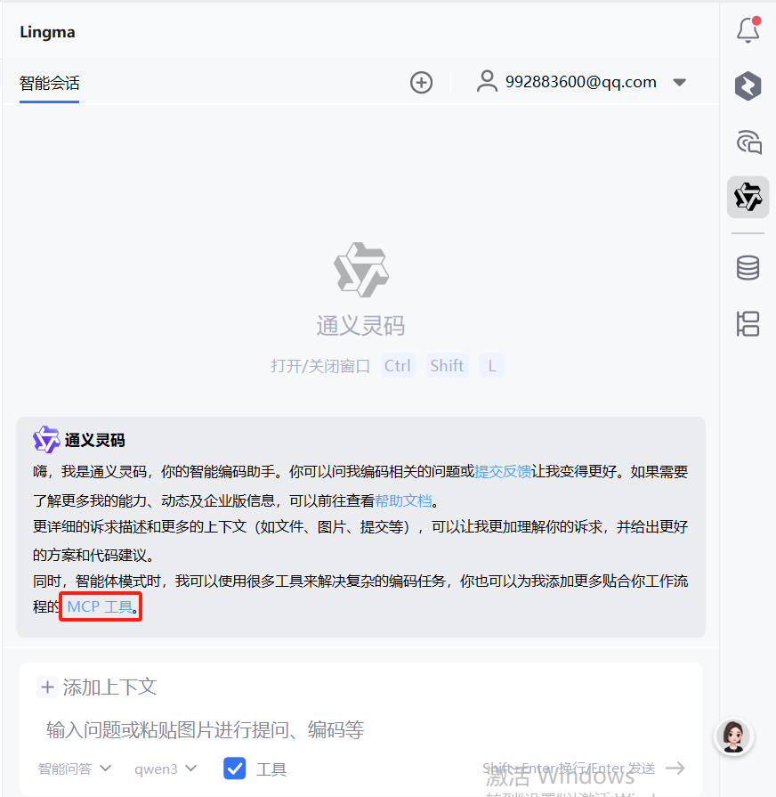

2. 添加MCP服务

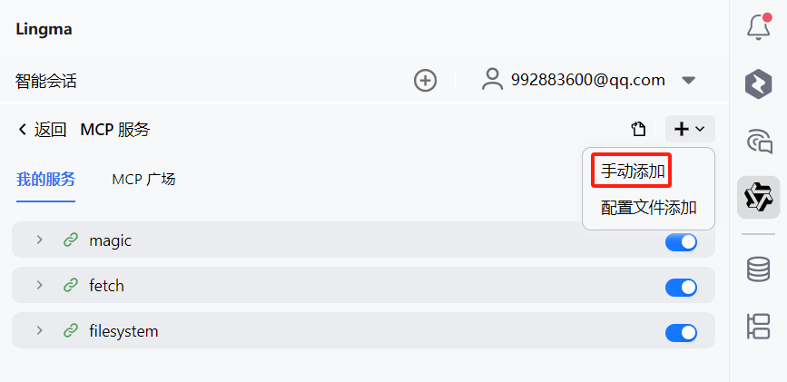

3. 添加MCP服务配置

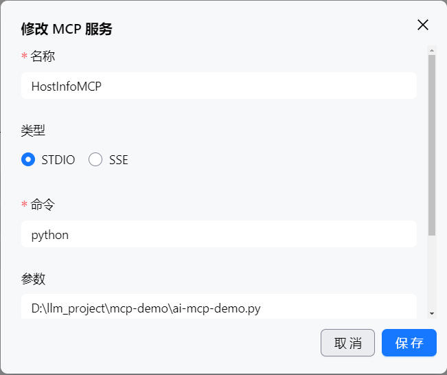

4. MCP服务列表

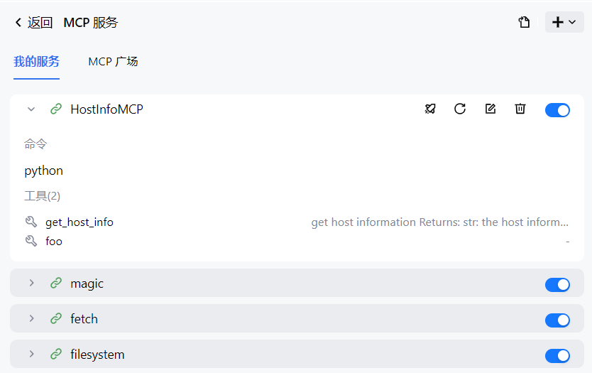

5. MCP服务测试

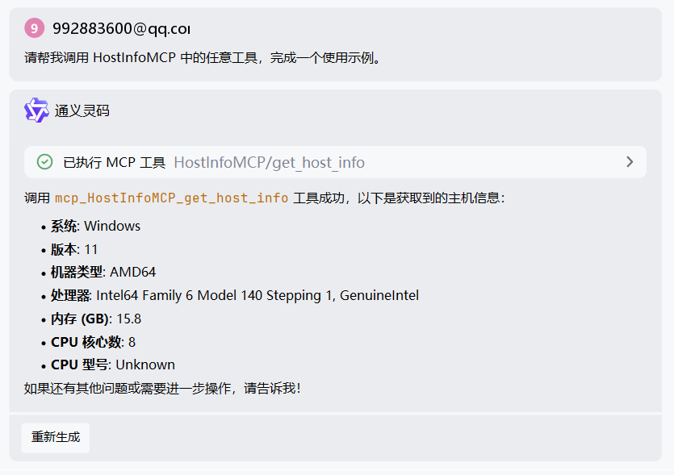

>  配置文件添加MCP服务配置

```json
    "HostInfoMCP": {
      "command": "python",
      "args": [
        "D:\\llm_project\\mcp-demo\\ai-mcp-demo.py"
      ]
    }
```


### 6. 在 Cherry Studio 中尝试 MCP

打开`Cherry Studio`客户端，到「设置 - MCP 服务器」把上面提示的两个环境完成安装：

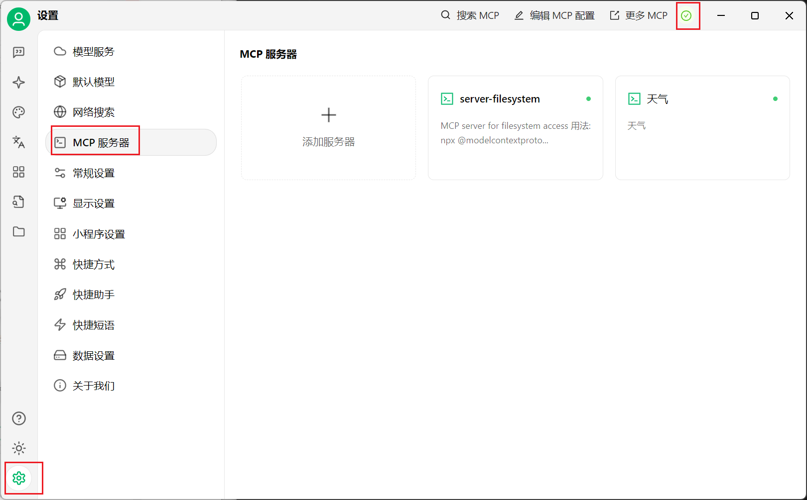

然后，在搜索框搜索`@modelcontextprotocol/server-filesystem`，这里接入一个简单的文件系统 MCP：

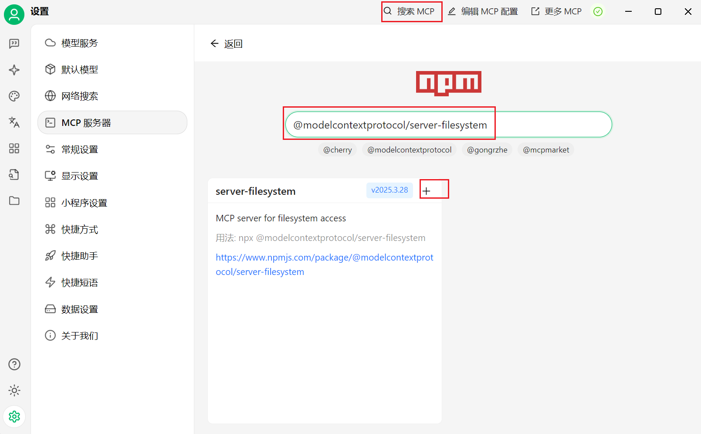

点击 + ，它会帮我们默认创建好一些 MCP Server 的配置，这里要补充一个参数，允许让它访问的文件夹路径，比如`~/Desktop`：

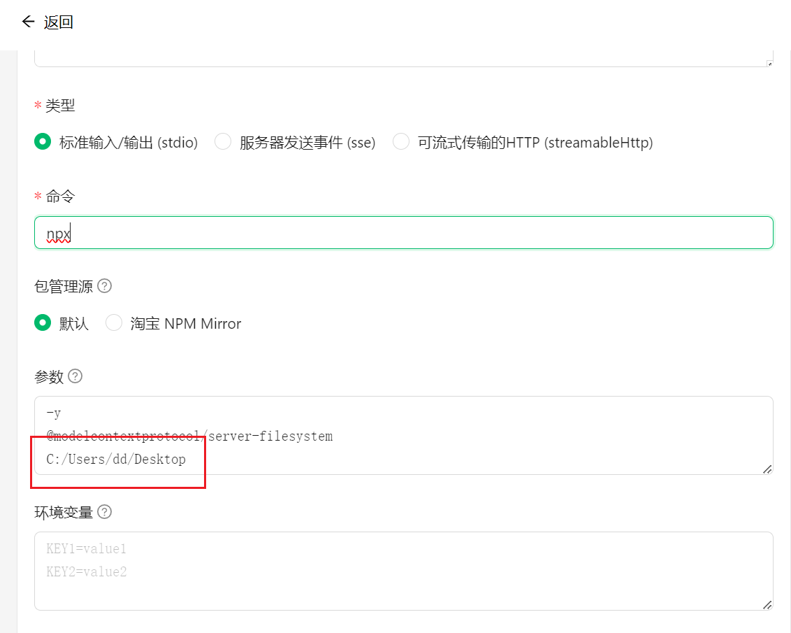

然后我们点击保存，如果服务器的绿灯亮起，说明配置成功：

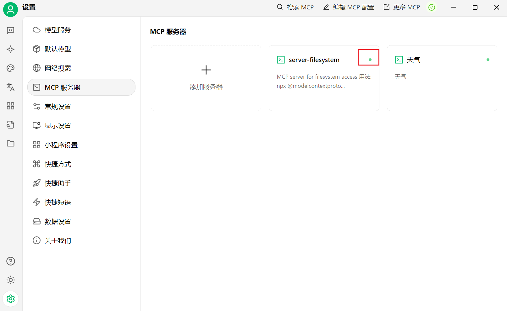

下面，到聊天区域选择一个模型， 注意这里一定要选择带扳手🔧图标的模型，只有这种工具才支持 MCP（因为 Cherry Studio 其实本质上还是基于 Function Call 实现的 MCP，所以只有部分模型支持）

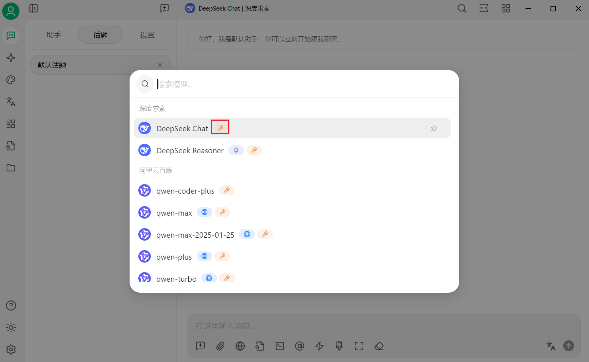

然后我们发现下面工具箱多了 MCP 的开关，我们把它打开：

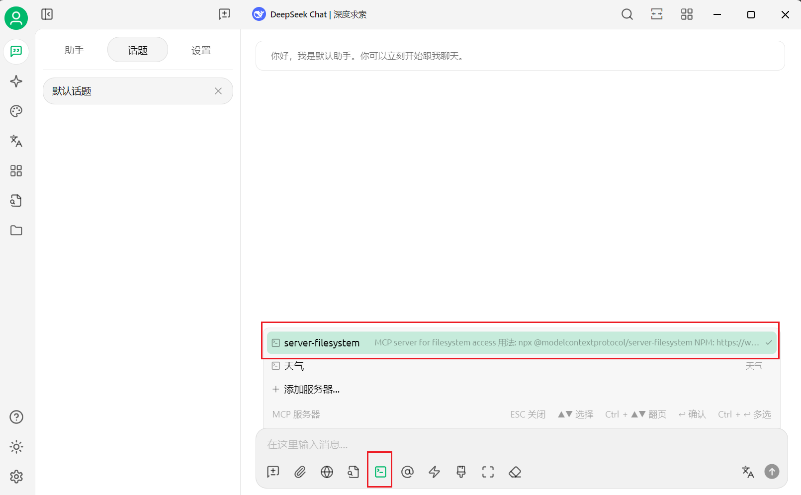

然后尝试让他访问我桌面上有哪些文件：

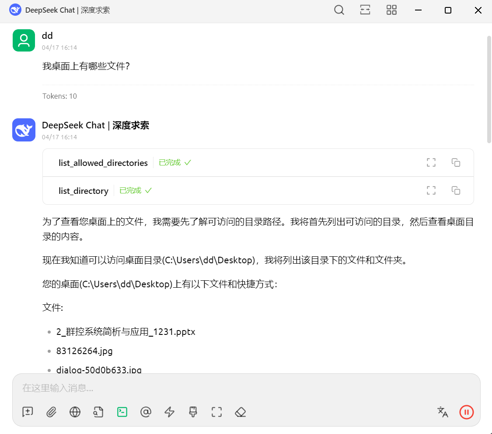

调用成功，这就是一个最简单的 MCP 调用示例了。


## 十二. 项目实战

### 六. 智谱AI(拓展二)

#### 1 智谱 api key

- 注册账户，实名认证

> https://open.bigmodel.cn/login?redirect=%2Fusercenter%2Fapikeys

- 获取api key

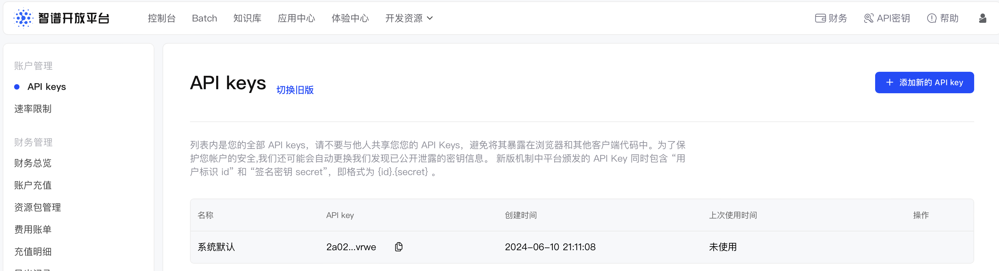

#### 2 智谱 api和LangChain

- 官方参考代码

> https://python.langchain.com/v0.2/docs/integrations/chat/zhipuai/


### 七. 修改chatbot场景(拓展三)

#### 1 修改prompt模板

- 在prompt.py文件中，修改chatbot的场景，例如：咖啡、旅游、餐饮等。


## 其他

```powershell
# 安装modelscope
PS D:\modelscope> pip install modelscope
Installing collected packages: modelscope
  WARNING: The script modelscope.exe is installed in 'C:\Users\qingy\AppData\Roaming\Python\Python313\Scripts' which is not on PATH.
  Consider adding this directory to PATH or, if you prefer to suppress this warning, use --no-warn-script-location.
  
# 追加到环境变量PATH
C:\Users\qingy\AppData\Roaming\Python\Python313\Scripts

# Load the model
from sentence_transformers import SentenceTransformer
embedding_model = SentenceTransformer("Qwen/Qwen3-Embedding-8B")
```


